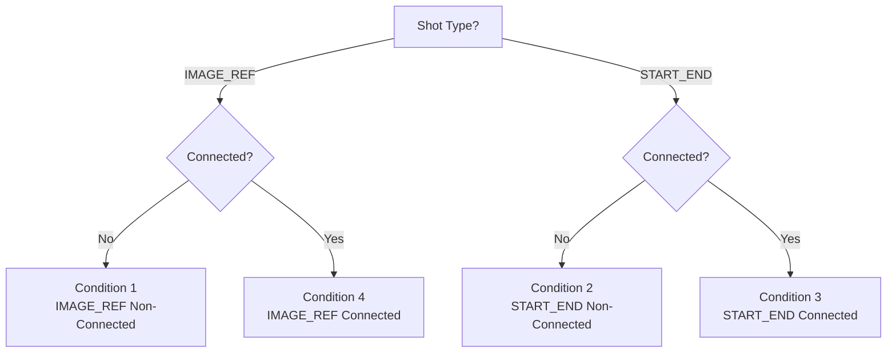
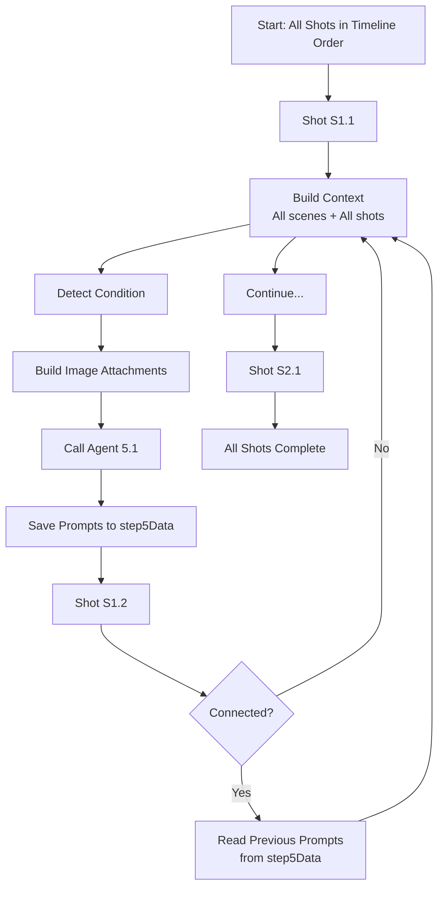

# Agent 5.1: Prompt Architect — Visual Logic Guide

## Overview

Agent 5.1 is the **Prompt Architect** — an AI agent that writes generation-ready prompts for each shot in your video. It analyzes context, visual assets, and shot relationships to create precise prompts with @ tag placeholders.

**Key Principle:** Agent 5.1 writes prompts **before** any images/videos are generated. It uses @ tags as placeholders that Agent 5.2 will later replace with actual asset URLs.

---

## The 4 Conditions

Agent 5.1 handles **4 distinct conditions** based on two factors:
1. **Shot Type:** `IMAGE_REF` (single keyframe) or `START_END` (two frames)
2. **Connection Status:** Connected to previous shot or not



### Condition Matrix

| Condition | Shot Type | Connected | Images Generated | Video Generated | What Agent 5.1 Writes |
|-----------|-----------|-----------|------------------|-----------------|----------------------|
| **1** | IMAGE_REF | ❌ No | 1 | 1 | 1 image prompt + 1 video prompt |
| **2** | START_END | ❌ No | 2 (Start + End) | 1 | 1 start + 1 end + 1 video |
| **3** | START_END | ✅ Yes | 1 (End only) | 1 | 1 end + 1 video |
| **4** | IMAGE_REF | ✅ Yes | 0 (Inherited) | 1 | 1 video only |

---

## Condition 1: IMAGE_REF (Non-Connected)

### Visual Flow

```
┌─────────────────────────────────────────────────────────┐
│              CONDITION 1: IMAGE_REF (Non-Connected)     │
└─────────────────────────────────────────────────────────┘

Agent 5.1 Receives:
├── Full context (all scenes, all shots, campaign, assets)
├── Target shot details
└── Visual assets (product, logo, character, style if referenced)

Agent 5.1 Writes:
├── 1 Image Prompt (single keyframe)
│   └── Uses @ tags: @Product, @Logo, @Character, @Style, @Shot_X
└── 1 Video Prompt (animates the keyframe)

Agent 5.2 Executes:
├── Step 1: Inject @ tags → Generate Image
└── Step 2: Generate Video (using generated image)

Result:
└── 1 image + 1 video
```

### Example Output

```json
{
  "shot_id": "S1.1",
  "condition": 1,
  "shot_type": "IMAGE_REF",
  "is_connected": false,
  "prompts": {
    "image": {
      "text": "Extreme macro close-up of luxury watch @Product with golden lighting @Style...",
      "tags_used": ["@Product", "@Style"]
    },
    "start_frame": null,
    "end_frame": null,
    "video": {
      "text": "Static macro shot with subtle micro-drift. Duration: 2.0s..."
    }
  }
}
```

---

## Condition 2: START_END (Non-Connected)

### Visual Flow

```
┌─────────────────────────────────────────────────────────┐
│           CONDITION 2: START_END (Non-Connected)         │
└─────────────────────────────────────────────────────────┘

Agent 5.1 Receives:
├── Full context (all scenes, all shots, campaign, assets)
├── Target shot details
└── Visual assets (product, logo, character, style if referenced)

Agent 5.1 Writes:
├── 1 Start Frame Prompt (opening composition)
│   └── Uses @ tags: @Product, @Logo, @Character, @Style
├── 1 End Frame Prompt (closing composition)
│   └── Uses @ tags: @Product, @Logo, @Style, @StartFrame ⚠️
└── 1 Video Prompt (interpolation between frames)

Agent 5.2 Executes:
├── Step 1: Inject @ tags → Generate Start Frame
├── Step 2: Replace @StartFrame with startFrameUrl → Generate End Frame
└── Step 3: Generate Video (using Start + End frames)

Result:
└── 2 images (start + end) + 1 video
```

### Critical Detail: @StartFrame

**@StartFrame** is a placeholder that Agent 5.1 writes in the End Frame prompt. Agent 5.2 will replace it with the actual generated Start Frame URL.

**Example End Frame Prompt:**
```
"Generate the END FRAME that continues from @StartFrame.
After dolly-in completes: Product now fills 75% of frame...
Same brushed titanium, same golden lighting...
Maintain absolute consistency with @StartFrame.
@Product @Style @StartFrame"
```

### Example Output

```json
{
  "shot_id": "S1.2",
  "condition": 2,
  "shot_type": "START_END",
  "is_connected": false,
  "prompts": {
    "image": null,
    "start_frame": {
      "text": "Medium close-up of watch at START of dolly-in... @Product @Style",
      "tags_used": ["@Product", "@Style"]
    },
    "end_frame": {
      "text": "Generate the END FRAME that continues from @StartFrame... @Product @Style @StartFrame",
      "tags_used": ["@Product", "@Style", "@StartFrame"]
    },
    "video": {
      "text": "Smooth dolly-in interpolation between start and end frames..."
    }
  }
}
```

---

## Condition 3: START_END (Connected)

### Visual Flow

```
┌─────────────────────────────────────────────────────────┐
│            CONDITION 3: START_END (Connected)            │
└─────────────────────────────────────────────────────────┘

Agent 5.1 Receives:
├── Full context (all scenes, all shots, campaign, assets)
├── Target shot details
├── Visual assets (product, logo, character, style if referenced)
└── ⚠️ PREVIOUS SHOT CONTEXT (text only):
    ├── Previous shot ID
    ├── Previous end frame prompt (how inherited image was described)
    └── Previous video prompt (motion that led to end frame)

Agent 5.1 Writes:
├── ❌ NO Start Frame Prompt (inherited from previous shot)
├── 1 End Frame Prompt (closing composition)
│   └── Uses @ tags: @Product, @Logo, @Style, @StartFrame ⚠️
│   └── @StartFrame = previous shot's end frame (inherited)
└── 1 Video Prompt (interpolation)

Agent 5.2 Executes:
├── Step 1: Inherit Start Frame = Previous shot's End Frame URL
├── Step 2: Replace @StartFrame with inherited URL → Generate End Frame
└── Step 3: Generate Video (using inherited Start + generated End)

Result:
└── 1 image (end only, start inherited) + 1 video
```

### Critical Detail: Previous Shot Context

For connected shots, Agent 5.1 receives **previous shot's prompts as text** (not images, since they're not generated yet). This allows Agent 5.1 to:

1. **Match visual language** from previous prompts
2. **Continue motion logic** (if previous was dolly-in, continue or transition)
3. **Maintain consistency** in subject identity, lighting, materials

**Previous Shot Context Structure:**
```typescript
previous_shot_context: {
  previous_shot_id: "S1.2",
  previous_end_frame_prompt: "Generate the END FRAME... brushed titanium...",
  previous_video_prompt: "Smooth dolly-in interpolation..."
}
```

### Example Output

```json
{
  "shot_id": "S1.3",
  "condition": 3,
  "shot_type": "START_END",
  "is_connected": true,
  "prompts": {
    "image": null,
    "start_frame": null,  // Inherited from S1.2
    "end_frame": {
      "text": "Generate the END FRAME that continues from @StartFrame. After orbit completes: Product rotated 90 degrees... Same brushed titanium, same golden lighting... @Product @Style @StartFrame",
      "tags_used": ["@Product", "@Style", "@StartFrame"]
    },
    "video": {
      "text": "Smooth orbit interpolation between inherited start and generated end..."
    }
  },
  "inheritance_note": "Start frame inherited from S1.2 end frame"
}
```

---

## Condition 4: IMAGE_REF (Connected)

### Visual Flow

```
┌─────────────────────────────────────────────────────────┐
│            CONDITION 4: IMAGE_REF (Connected)           │
└─────────────────────────────────────────────────────────┘

Agent 5.1 Receives:
├── Full context (all scenes, all shots, campaign, assets)
├── Target shot details
└── ⚠️ PREVIOUS SHOT CONTEXT (text only):
    ├── Previous shot ID
    ├── Previous end frame prompt
    └── Previous video prompt

Agent 5.1 Writes:
├── ❌ NO Image Prompt (inherited from previous shot)
└── 1 Video Prompt ONLY (camera movement on inherited image)
    └── Focus: Camera movement only (pan, zoom, drift)
    └── Image content is FIXED - cannot change

Agent 5.2 Executes:
├── Step 1: Inherit Image = Previous shot's End Frame URL
└── Step 2: Generate Video (animates inherited image)

Result:
└── 0 images (inherited) + 1 video
```

### Critical Detail: Image is Fixed

For Condition 4, the image is **completely inherited** and **cannot be changed**. Agent 5.1 only writes a video prompt describing camera movement.

**Example Video Prompt:**
```
"Animate the inherited image with a slow pan motion.
Camera Path: Pan (left to right). Duration: 2.0s.
The image content remains static — only the camera viewport moves.
Maintain absolute object permanence."
```

### Example Output

```json
{
  "shot_id": "S1.4",
  "condition": 4,
  "shot_type": "IMAGE_REF",
  "is_connected": true,
  "prompts": {
    "image": null,  // Inherited from S1.3
    "start_frame": null,
    "end_frame": null,
    "video": {
      "text": "Animate the inherited image with a slow pan motion. Camera Path: Pan (left to right). The image content remains static — only camera movement applies."
    }
  },
  "inheritance_note": "Image inherited from S1.3 end frame"
}
```

---

## @ Tag System

### Dynamic Tags (Agent 4.1 Decides)

These tags are used when Agent 4.1 (Cinematic Media Planner) specifies them in `identity_references`:

| Tag | When to Use | Meaning | Image Source |
|-----|-------------|---------|--------------|
| `@Product` | `refer_to_product = true` + `product_image_ref = "heroProfile"` | Main product image for identity | Tab 2 Hero Profile |
| `@Product_Macro` | `refer_to_product = true` + `product_image_ref = "macroDetail"` | Close-up detail for texture | Tab 2 Macro Detail |
| `@Texture` | `refer_to_product = true` + `product_image_ref = "materialReference"` | Material/texture reference | Tab 2 Material Reference |
| `@Logo` | `refer_to_logo = true` | Brand logo for typography | Tab 2 Logo |
| `@Character` | `refer_to_character = true` | Character for identity consistency | Tab 2 Character |
| `@Shot_SX.Y` | `refer_to_previous_outputs` includes this shot | Previous shot's generated output | Generated output (must exist) |

### Static Tags (Auto-Applied)

These tags are automatically applied based on condition or settings:

| Tag | When Applied | Meaning | Source |
|-----|--------------|---------|--------|
| `@Style` | `style_source = "uploaded"` | Style/moodboard reference | Tab 3 Style Reference |
| `@StartFrame` | Condition 2, 3 — End Frame prompts only | Reference to start frame | Generated or inherited |

### How Tags Work

1. **Agent 5.1 writes prompts with @ tags as placeholders:**
   ```
   "Luxury watch @Product with golden lighting @Style..."
   ```

2. **@ tags stay in the text as labels** (they are NOT replaced by Agent 5.1)

3. **Agent 5.2 injects actual image URLs** when generating:
   - Scans prompt for @ tags
   - Builds labeled image attachment array
   - Sends prompt + labeled images to generation model
   - Model associates labels with attached images

### Tag Usage Example

```typescript
// Agent 5.1 writes:
{
  "text": "Extreme close-up of luxury chronograph @Product with brushed titanium bezel. Golden directional light @Style creating elegant highlights. @Logo visible on dial.",
  "tags_used": ["@Product", "@Style", "@Logo"]
}

// Agent 5.2 injects:
{
  prompt: "...@Product...@Style...@Logo...",  // Tags stay in text
  images: [
    { label: "@Product", url: "https://.../product-hero.jpg" },
    { label: "@Style", url: "https://.../style-moodboard.jpg" },
    { label: "@Logo", url: "https://.../logo.png" }
  ]
}
```

---

## Context Structure

Agent 5.1 receives **8 sections** of context for each shot:

### Section 1: Strategic Foundation (The "Why")
- Target audience (MENA, Gen Z, Luxury, etc.)
- Campaign objective (brand-awareness, feature-showcase, sales-cta)
- Pacing profile (FAST_CUT, LUXURY_SLOW, KINETIC_RAMP, STEADY_CINEMATIC)

### Section 2: Narrative Vision (The "Story")
- Creative spark (campaign's core idea)
- Visual beat 1 (Act 1: The Hook)
- Visual beat 2 (Act 2: The Transformation)
- Visual beat 3 (Act 3: The Payoff)

### Section 3: Visual Identity (The "Look")
- Environment concept (sleek black void, warm studio, etc.)
- Lighting preset (golden-hour, studio-soft, dramatic-contrast, neon-glow)
- Atmospheric density (0-100)
- Environment colors (primary, secondary)
- Style source (preset or uploaded)

### Section 4: Subject Assets (The "What" — Vision Input)
- **Product image** (if `refer_to_product = true`)
  - Which image: heroProfile, macroDetail, or materialReference
  - Material preset, object mass, surface complexity, hero feature
- **Logo image** (if `refer_to_logo = true`)
- **Character image** (if `refer_to_character = true`)
- **Style reference** (if uploaded)
- **Previous shot outputs** (if `refer_to_previous_outputs` specified)
- **⚠️ NOT inherited images** (they don't exist yet for connected shots)

### Section 5: Scene Context (The "Where")
- **All scenes overview:** List of all scenes with IDs, names, descriptions
- **All shots in all scenes:** Complete details of every shot (not summaries)
  - shot_id, shot_name, description, shot_type, camera_path, lens, framing, motion_intensity, duration, is_connected_to_previous, connects_to_next, etc.
- **Current scene:** The scene containing the target shot (for context)

### Section 6: Target Shot (The "Task")
- Complete details of the shot being processed:
  - From Agent 4.1: shot_id, name, description, framing, camera_path, lens, motion_intensity, shot_type, is_connected_to_previous, connects_to_next
  - From Agent 4.2: rendered_duration, multiplier, curve_type
  - VFX seeds: frame_consistency_scale, motion_blur_intensity, temporal_coherence_weight
  - Position: shot_position_in_scene, is_first_in_scene, is_last_in_scene

### Section 7: Custom Instructions (The "Override")
- Custom image instructions (user guidance)
- Global motion DNA (camera and physics rules)

### Section 8: Shot Type Directive (The "How")
- Condition-specific instructions telling Agent 5.1 exactly what to output
- Different for each condition (1, 2, 3, or 4)

### Previous Shot Context (Condition 3 & 4 Only)
- Previous shot ID
- Previous end frame prompt (text) — how inherited image was described
- Previous video prompt (text) — motion that led to end frame

---

## Sequential Processing Flow

Agent 5.1 processes shots **one at a time** in timeline order:



### Step-by-Step Process

1. **Flatten all shots** from all scenes into timeline order:
   ```
   S1.1 → S1.2 → S1.3 → S2.1 → S2.2 → S2.3 → S3.1 → ...
   ```

2. **For each shot:**
   - Build complete context (all 8 sections)
   - **If connected (Condition 3 or 4):**
     - Read previous shot's prompts from `step5Data.shotPrompts[previous_shot_id]`
     - Extract: `end_frame_prompt.text`, `video_prompt.text`
     - Add to `previous_shot_context`
   - Detect condition
   - Build image attachments (exclude inherited images)
   - Call Agent 5.1
   - **Save immediately** to `step5Data.shotPrompts[shot_id]`

3. **Continue to next shot** (previous prompts now available)

### Why Sequential?

- **Connected shots need previous prompts:** Condition 3 & 4 require previous shot's prompts to maintain consistency
- **@Shot_X references need generated outputs:** If a shot references a previous shot's output, that output must exist
- **Recovery:** Saving after each shot allows recovery if process fails

### Example Sequence

```
Shot S1.1 (Condition 1):
├── Build context (no previous prompts needed)
├── Generate prompts
└── Save to step5Data.shotPrompts["S1.1"]

Shot S1.2 (Condition 2):
├── Build context (no previous prompts needed)
├── Generate prompts
└── Save to step5Data.shotPrompts["S1.2"]

Shot S1.3 (Condition 3 - Connected):
├── Build context
├── Read previous prompts from step5Data.shotPrompts["S1.2"]
│   ├── Extract: end_frame_prompt.text
│   └── Extract: video_prompt.text
├── Add to previous_shot_context
├── Generate prompts (with @StartFrame referencing S1.2's end frame)
└── Save to step5Data.shotPrompts["S1.3"]

Shot S1.4 (Condition 4 - Connected):
├── Build context
├── Read previous prompts from step5Data.shotPrompts["S1.3"]
├── Add to previous_shot_context
├── Generate video prompt only (image inherited from S1.3)
└── Save to step5Data.shotPrompts["S1.4"]
```

---

## Complete Example: Condition 2 Shot

### Input Context

```typescript
{
  // Section 1: Strategic
  strategic_foundation: {
    target_audience: "MENA / Arab Region",
    campaign_objective: "feature-showcase"
  },
  
  // Section 2: Narrative
  narrative_vision: {
    creative_spark: "Timeless elegance meets modern precision",
    visual_beat_1: "A mysterious unveiling in golden light",
    visual_beat_2: "The transformation reveals intricate details",
    visual_beat_3: "The payoff: pure luxury captured"
  },
  
  // Section 3: Visual
  visual_identity: {
    environment_concept: "Sleek black void with golden spotlight",
    lighting_preset: "golden-hour",
    atmospheric_density: 70,
    style_source: "preset"
  },
  
  // Section 4: Assets
  subject_assets: {
    product: {
      image_url: "https://.../product-hero.jpg",
      image_ref: "heroProfile",
      material_preset: "metallic",
      hero_feature: "The brushed titanium bezel"
    }
  },
  
  // Section 5: Scene Context
  scene_context: {
    all_scenes: [
      { scene_id: "S1", scene_name: "Scene 1: The Ignition", ... },
      { scene_id: "S2", scene_name: "Scene 2: The Transformation", ... }
    ],
    all_shots: [
      { shot_id: "S1.1", shot_name: "Macro Reveal", ... },
      { shot_id: "S1.2", shot_name: "Hero Reveal", ... },  // ← Target shot
      { shot_id: "S1.3", shot_name: "Orbit Rotation", ... }
    ],
    current_scene: { scene_id: "S1", ... }
  },
  
  // Section 6: Target Shot
  target_shot: {
    shot_id: "S1.2",
    shot_name: "Shot 1.2: Hero Reveal",
    description: "Dolly-in reveals the watch face in stunning detail",
    shot_type: "START_END",
    is_connected_to_previous: false,
    multiplier: 6,
    curve_type: "EASE_OUT",
    rendered_duration: 2.5
  },
  
  // Section 7: Custom
  custom_instructions: {
    custom_image_instructions: "Focus on the metallic textures"
  },
  
  // Section 8: Directive
  condition: 2  // START_END (Non-Connected)
}
```

### Agent 5.1 Output

```json
{
  "shot_id": "S1.2",
  "condition": 2,
  "shot_type": "START_END",
  "is_connected": false,
  "prompts": {
    "image": null,
    "start_frame": {
      "text": "Extreme macro close-up of luxury chronograph watch at the START of dolly-in motion. Brushed titanium bezel fills 40% of frame, positioned left-of-center. Golden directional light from upper left creating elegant highlights on metal surfaces. Macro lens perspective, shallow depth of field. Sleek black void environment. @Product",
      "tags_used": ["@Product"]
    },
    "end_frame": {
      "text": "Generate the END FRAME that continues from @StartFrame. After dolly-in camera motion completes: Same chronograph now fills 85% of frame, perfectly centered. The dial is now hero — subdials prominent, rose gold catching light. Same brushed titanium, same golden lighting temperature, same midnight blue dial. Only composition changed — camera closer. Maintain absolute consistency with @StartFrame. @Product @StartFrame",
      "tags_used": ["@Product", "@StartFrame"]
    },
    "video": {
      "text": "Bold, dynamic dolly-in interpolation between start and end frames. Camera Path: Dolly-In. Duration: 2.5s. Speed Profile: Kinetic with subtle ease-out. Absolute object permanence — geometry locked, no warping. Lighting consistency: Maintain golden-hour temperature throughout."
    }
  }
}
```

---

## Summary: Key Points

### ✅ What Agent 5.1 Does

1. **Receives complete context** for each shot (all scenes, all shots, campaign, assets)
2. **Detects condition** (1, 2, 3, or 4) based on shot type and connection
3. **Writes prompts with @ tags** as placeholders
4. **For connected shots:** Reads previous shot's prompts (text only) to maintain consistency
5. **Processes sequentially** (one shot at a time in timeline order)

### ✅ What Agent 5.1 Does NOT Do

1. **Does NOT generate images/videos** (that's Agent 5.2's job)
2. **Does NOT receive inherited images** (they don't exist yet)
3. **Does NOT replace @ tags** (they stay as placeholders)
4. **Does NOT process shots in parallel** (must be sequential for connected shots)

### ✅ Critical Rules

1. **@StartFrame** must appear in end_frame prompts for Conditions 2 & 3
2. **Previous shot prompts** are provided as text only (not images) for Conditions 3 & 4
3. **All scenes and all shots** details are included in context (not summaries)
4. **Sequential processing** ensures previous prompts are available when needed
5. **@ tags** are clearly explained in the user prompt via @ TAG REFERENCE GUIDE

---

## Visual Condition Comparison

```
CONDITION 1: IMAGE_REF (Non-Connected)
┌─────────────┐
│   Image     │ ← Generated from prompt
└─────────────┘
       ↓
┌─────────────┐
│   Video     │ ← Animates image
└─────────────┘

CONDITION 2: START_END (Non-Connected)
┌─────────────┐     ┌─────────────┐
│ Start Frame │ → → │  End Frame  │ ← Both generated
└─────────────┘     └─────────────┘
       ↓                   ↓
       └─────────┬─────────┘
                 ↓
         ┌─────────────┐
         │   Video     │ ← Interpolates between frames
         └─────────────┘

CONDITION 3: START_END (Connected)
┌─────────────┐     ┌─────────────┐
│ Start Frame │ → → │  End Frame  │
│ (INHERITED) │     │ (Generated) │
└─────────────┘     └─────────────┘
       ↓                   ↓
       └─────────┬─────────┘
                 ↓
         ┌─────────────┐
         │   Video     │ ← Interpolates
         └─────────────┘

CONDITION 4: IMAGE_REF (Connected)
┌─────────────┐
│   Image     │ ← Inherited (FIXED)
│ (INHERITED) │
└─────────────┘
       ↓
┌─────────────┐
│   Video     │ ← Camera movement only
└─────────────┘
```

---

## Quick Reference: Condition Decision Tree

```
Is shot_type = "IMAGE_REF"?
├── YES → Is is_connected_to_previous = true?
│   ├── YES → Condition 4 (IMAGE_REF Connected)
│   └── NO  → Condition 1 (IMAGE_REF Non-Connected)
│
└── NO (START_END) → Is is_connected_to_previous = true?
    ├── YES → Condition 3 (START_END Connected)
    └── NO  → Condition 2 (START_END Non-Connected)
```

---

## End of Guide

This guide explains how Agent 5.1 works with conditions, tags, context, and sequential processing. For implementation details, see the main implementation plan.


