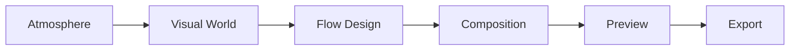
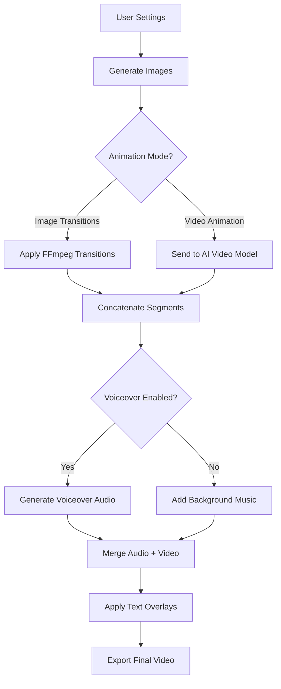
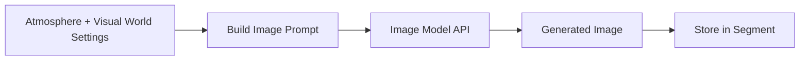
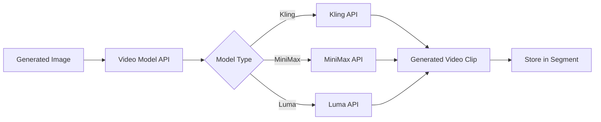
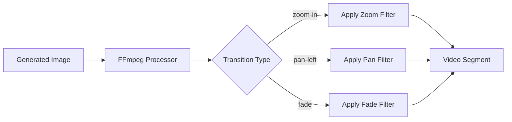

# Ambient Visualizer - Technical Documentation

## Overview

The Ambient Visualizer is a tool for creating long-form, loopable ambient videos for meditation, focus, background ambiance, and relaxation. It generates visually stunning, atmospheric content ranging from 5 minutes to 2 hours.

---

## Table of Contents

1. [Onboarding](#onboarding)
2. [Workflow Steps](#workflow-steps)
3. [Step 1: Atmosphere](#step-1-atmosphere)
4. [Step 2: Visual World](#step-2-visual-world)
5. [Step 3: Flow Design](#step-3-flow-design)
6. [Step 4: Composition](#step-4-composition)
7. [Step 5: Preview](#step-5-preview)
8. [Step 6: Export](#step-6-export)
9. [Backend Architecture](#backend-architecture)
10. [Data Models](#data-models)

---

## Onboarding

Before entering the main workflow, users go through a quick onboarding process to configure the project's animation approach.

### Onboarding Step 1: Animation Mode Selection

**Purpose**: Choose the fundamental animation technique

**Options**:
1. **Image Transitions**
   - Creates ambient visuals using static images with motion effects (zoom, pan, Ken Burns)
   - Faster generation
   - No additional configuration needed
   - Proceeds directly to Atmosphere (Step 1)

2. **Video Animation**
   - Generates AI-powered animated videos from images
   - Uses advanced video models for natural motion
   - Requires additional configuration (Step 2 of onboarding)

### Onboarding Step 2: Video Generation Mode (Conditional)

**Visibility**: Only shown if "Video Animation" was selected in Step 1

**Purpose**: Choose how to generate animated videos

**Options**:
1. **Image Reference Mode**
   - Generate video from a single reference image
   - AI animates the scene based on motion prompts
   - Simpler workflow

2. **Start/End Frame Mode**
   - Define both starting and ending frames
   - AI creates smooth transitions between states
   - More precise control over animation

**After onboarding completion, the selected modes are:**
- Locked and displayed as read-only in Atmosphere settings
- Used throughout the workflow to show/hide relevant settings
- Stored as project configuration

---

## Workflow Steps

After completing onboarding, the Ambient Visualizer follows a 6-step workflow:



---

## Step 1: Atmosphere

**Purpose**: Define the emotional foundation and technical settings for the ambient visual.

### Settings Structure

#### 1.1 Aspect Ratio
- **Type**: Selection (single choice)
- **Options**:
  - `16:9` - YouTube (Horizontal)
  - `9:16` - TikTok, Reels (Vertical)
  - `1:1` - Instagram (Square)
  - `4:5` - Feed Posts (Portrait)
- **Default**: `16:9`
- **Backend Field**: `aspectRatio: string`

#### 1.2 Target Duration
- **Type**: Selection (single choice)
- **Options**:
  - `5min` - 5 minutes
  - `10min` - 10 minutes
  - `30min` - 30 minutes
  - `1hour` - 1 hour
  - `2hours` - 2 hours
- **Default**: `5min`
- **Backend Field**: `duration: string`
- **Backend Processing**: Convert to seconds (e.g., `5min` → `300` seconds)

#### 1.3 Primary Mood
- **Type**: Selection (single choice)
- **Options**:
  - `calm` - Peaceful and serene
  - `mysterious` - Enigmatic and intriguing
  - `energetic` - Dynamic and vibrant
  - `nostalgic` - Wistful and sentimental
  - `cozy` - Warm and comfortable
  - `dark` - Moody and intense
  - `dreamy` - Surreal and floating
  - `ethereal` - Otherworldly and delicate
- **Default**: `calm`
- **Backend Field**: `mood: string`

#### 1.4 Theme / Environment
- **Type**: Selection (single choice)
- **Options**:
  - `nature` - Natural landscapes
  - `urban` - City and architecture
  - `abstract` - Abstract shapes and forms
  - `cosmic` - Space and celestial
  - `interior` - Indoor spaces
  - `fantasy` - Magical and fantastical
- **Default**: `nature`
- **Backend Field**: `theme: string`

#### 1.5 Time Context (Smart Dynamic)
- **Type**: Selection (single choice, theme-dependent)
- **Behavior**: Options change based on selected theme
- **Backend Field**: `timeContext: string`

**Options by Theme**:

| Theme | Label | Options |
|-------|-------|---------|
| `nature`, `urban` | Time of Day | `dawn`, `day`, `sunset`, `night`, `timeless` |
| `cosmic` | Lighting Type | `bright-nebula`, `dark-void`, `star-field`, `eclipse`, `aurora` |
| `abstract` | Energy State | `static`, `flowing`, `pulsing`, `chaotic`, `balanced` |
| `interior` | Lighting Mood | `morning-light`, `afternoon`, `golden-hour`, `evening`, `ambient` |
| `fantasy` | Magical Time | `ethereal-dawn`, `mystical-day`, `enchanted-dusk`, `moonlit-night`, `twilight` |

#### 1.6 Season / Weather (Smart Dynamic)
- **Type**: Selection (single choice, theme-dependent)
- **Behavior**: Options change based on selected theme
- **Backend Field**: `season: string`

**Options by Theme**:

| Theme | Label | Options |
|-------|-------|---------|
| `nature`, `urban` | Season / Weather | `spring`, `summer`, `autumn`, `winter`, `rainy`, `snowy`, `foggy`, `neutral` |
| `cosmic` | Space Density | `sparse`, `moderate`, `dense`, `nebulous`, `energetic`, `calm` |
| `abstract` | Complexity Level | `minimal`, `moderate`, `complex`, `intense`, `layered` |
| `interior` | Ambiance | `warm-cozy`, `cool-fresh`, `natural-light`, `dim-moody`, `bright-airy` |
| `fantasy` | Magical Condition | `magical-bloom`, `mystical-mist`, `enchanted-frost`, `fairy-lights`, `elemental` |

#### 1.7 Animation Mode (Read-Only)
- **Type**: Display only (selected during onboarding)
- **Values**:
  - `image-transitions` - Image Transitions (static images with motion effects)
  - `video-animation` - Video Animation (AI-generated video from images)
- **Backend Field**: `animationMode: 'image-transitions' | 'video-animation'`
- **Note**: This value is set during the onboarding process and cannot be changed in the Atmosphere settings

**Additional Display** (for Video Animation mode):
- **Video Generation Mode**: Shows `image-reference` or `start-end-frame` (also selected during onboarding)

**Purpose**: Displays the animation approach selected during project setup and shows/hides relevant settings accordingly

##### 1.7.1 Image Transitions Settings

**When `animationMode === 'image-transitions'`**:

- **Default Easing Style**
  - **Type**: Selection (single choice)
  - **Options**:
    - `smooth` - Smooth (ease-in-out)
    - `linear` - Linear (constant speed)
    - `ease-in-out` - Ease In-Out
    - `cinematic` - Cinematic
  - **Default**: `smooth`
  - **Backend Field**: `easingStyle: string`
  - **Usage**: Default easing for all image transitions (can be overridden per segment)

##### 1.7.2 Video Animation Settings

**When `animationMode === 'video-animation'`**:

- **Video Model**
  - **Type**: Dropdown selection
  - **Options**:
    - `kling-1.6` - Kling 1.6
    - `minimax-video-01` - MiniMax Video 01
    - `luma-ray` - Luma Ray
  - **Default**: `kling-1.6`
  - **Backend Field**: `videoModel: string`
  - **Backend Integration**: Different API endpoints per model

- **Resolution**
  - **Type**: Button selection
  - **Options**:
    - `720p` - 720p
    - `1080p` - 1080p
    - `4k` - 4K
  - **Default**: `1080p`
  - **Backend Field**: `videoResolution: string`

- **Motion Prompt**
  - **Type**: Textarea (multiline text)
  - **Placeholder**: "e.g., Gentle floating particles, subtle light rays moving slowly, soft camera drift..."
  - **Default**: Empty string
  - **Backend Field**: `motionPrompt: string`
  - **Usage**: Custom instructions for AI video generation, applied globally to all video segments

#### 1.8 Transition Style / Camera Motion (Conditional)

**This setting is conditional based on Animation Mode selected during onboarding.**

##### 1.8.1 When `animationMode === 'image-transitions'`

**Transition Style**
- **Type**: Button grid selection (2 columns)
- **Options**:
  - `crossfade` - Smooth Crossfade (Gentle blend between scenes)
  - `dissolve` - Slow Dissolve (Gradual fade transition)
  - `drift` - Drift (Floating motion blend)
  - `match-cut` - Match Cut (Seamless visual continuity)
  - `morph` - Morph (Shape transformation)
  - `wipe` - Soft Wipe (Directional reveal)
- **Default**: `crossfade`
- **Backend Field**: `transitionStyle: string`
- **Usage**: How images transition between each other

##### 1.8.2 When `animationMode === 'video-animation'`

**Camera Motion**
- **Type**: Button selection (flex wrap)
- **Options**:
  - `static` - Static
  - `slow-pan` - Slow Pan
  - `gentle-drift` - Gentle Drift
  - `orbit` - Orbit
  - `push-in` - Push In
  - `pull-out` - Pull Out
  - `float` - Floating
- **Default**: `slow-pan`
- **Backend Field**: `cameraMotion: string`
- **Usage**: Default camera movement for AI-generated video clips

**Note**: These settings occupy the same UI space and swap based on the selected Animation Mode.

#### 1.9 Pacing & Segment Settings

**Note**: Moved from Flow Design (Step 3) to Atmosphere for better workflow organization.

#### 1.10 Voiceover

**Note**: Voiceover is always the last setting in the Atmosphere tab.

##### 1.10.1 Enable Voiceover
- **Type**: Toggle (On/Off)
- **Default**: `false` (Off)
- **Backend Field**: `voiceoverEnabled: boolean`

##### 1.10.2 Voiceover Settings (Conditional)

**When `voiceoverEnabled === true`**:

- **Language**
  - **Type**: Dropdown selection
  - **Options**:
    - `en` - English (US)
    - `ar` - Arabic (العربية)
  - **Default**: `en`
  - **Backend Field**: `language: 'ar' | 'en'`

- **Text Overlay**
  - **Type**: Toggle (On/Off)
  - **Default**: `false` (Off)
  - **Backend Field**: `textOverlayEnabled: boolean`

- **Text Overlay Style** (when Text Overlay is On)
  - **Type**: Button selection
  - **Options**:
    - `modern` - Modern
    - `cinematic` - Cinematic
    - `bold` - Bold
  - **Default**: `modern`
  - **Backend Field**: `textOverlayStyle: 'modern' | 'cinematic' | 'bold'`

#### 1.9 Pacing & Flow Settings

##### 1.9.1 Pacing
- **Type**: Slider (0-100)
- **Type**: Slider (0-100)
- **Default**: `30`
- **Backend Field**: `pacing: number`
- **Usage**: Controls how quickly scenes change (0 = very slow/meditative, 100 = fast-paced/dynamic)

##### 1.9.2 Segment Settings
- **Type**: Toggle (On/Off)
- **Default**: `true` (On)
- **Backend Field**: `segmentEnabled: boolean`
- **Usage**: Enable custom segment configuration

###### 1.9.2.1 Segment Settings (Conditional - When Segments are ON)

**Number of Segments**
- **Type**: Auto or custom number input
- **Options**: `auto` or number (1-20)
- **Default**: `auto`
- **Backend Field**: `segmentCount: 'auto' | number`
- **Usage**: Number of distinct visual segments in your video

**Shots per Segment**
- **Type**: Auto or custom number input
- **Options**: `auto` or number (1-10)
- **Default**: `auto`
- **Backend Field**: `shotsPerSegment: 'auto' | number`
- **Usage**: Number of individual shots within each segment

##### 1.9.3 Seamless Loop
- **Type**: Toggle (On/Off)
- **Default**: `true` (On)
- **Backend Field**: `loopMode: boolean`
- **Usage**: When enabled, the video will loop back to the beginning seamlessly

###### 1.9.3.1 Loop Settings (Conditional - When Loop is ON)

**Loop Type**
- **Type**: Button selection (single choice)
- **Options**:
  - `seamless` - Seamless (perfect continuous loop)
  - `fade` - Fade (fade out then fade in)
  - `hard-cut` - Hard Cut (direct cut to beginning)
- **Default**: `seamless`
- **Backend Field**: `loopType: 'seamless' | 'fade' | 'hard-cut'`

**Segment Loop**
- **Type**: Toggle (On/Off)
- **Default**: `false` (Off)
- **Backend Field**: `segmentLoopEnabled: boolean`
- **Usage**: Loop each segment individually before moving to next

**Segment Loop Count** (when Segment Loop is ON)
- **Type**: Auto or custom number input
- **Options**: `auto` or number (1-10)
- **Default**: `auto`
- **Backend Field**: `segmentLoopCount: 'auto' | number`
- **Usage**: How many times to loop each segment

**Shot Loop**
- **Type**: Toggle (On/Off)
- **Default**: `false` (Off)
- **Backend Field**: `shotLoopEnabled: boolean`
- **Usage**: Loop individual shots within segments

**Shot Loop Count** (when Shot Loop is ON)
- **Type**: Auto or custom number input
- **Options**: `auto` or number (1-10)
- **Default**: `auto`
- **Backend Field**: `shotLoopCount: 'auto' | number`
- **Usage**: How many times to loop each shot

#### 1.11 AI Idea Generator

- **AI Prompt Input**
  - **Type**: Text input
  - **Placeholder**: "Ask AI to write an ambient visual about..."
  - **Backend Field**: `aiPrompt: string`

- **Your Idea (Mood Description)**
  - **Type**: Textarea (multiline)
  - **Placeholder**: "Write your ambient visual idea here, or use the AI generator above to create one..."
  - **Backend Field**: `moodDescription: string`
  - **Usage**: Detailed description that guides all generation (images, video, audio)

---

## Step 2: Visual World

**Purpose**: Define the artistic style and visual characteristics.

### Settings Structure

#### 2.1 Art Style
- **Type**: Selection
- **Backend Field**: `artStyle: string`
- **Usage**: Determines the visual rendering style for image generation

#### 2.2 Color Palette
- **Type**: Selection
- **Backend Field**: `colorPalette: string`
- **Usage**: Color scheme for all generated images

#### 2.3 Lighting Mood
- **Type**: Selection
- **Backend Field**: `lightingMood: string`
- **Usage**: Lighting conditions for image generation

#### 2.4 Texture
- **Type**: Selection
- **Backend Field**: `texture: string`
- **Usage**: Surface quality and detail level

#### 2.5 Visual Elements
- **Type**: Multi-select
- **Backend Field**: `visualElements: string[]`
- **Usage**: Specific elements to include in scenes

#### 2.6 Atmospheric Layers
- **Type**: Multi-select
- **Backend Field**: `atmosphericLayers: string[]`
- **Usage**: Environmental effects (fog, particles, etc.)

#### 2.7 Reference Images
- **Type**: Image upload (multiple)
- **Backend Field**: `referenceImages: string[]` (URLs or file paths)
- **Usage**: Style reference for image generation

---

## Step 3: Flow Design

**Purpose**: Define the rhythm, style, and evolution of the ambient visual.

**Note**: Pacing, Segment Count, Loop Mode, Transition Style, and Camera Motion have been moved to Step 1 (Atmosphere) for better workflow organization.

### Settings Structure

#### 3.1 Variation Type
- **Type**: Selection
- **Options**: `evolving`, `static`, `cycling`
- **Backend Field**: `variationType: string`
- **Usage**: How visuals change over time

#### 3.2 Visual Rhythm
- **Type**: Selection
- **Backend Field**: `visualRhythm: string`
- **Usage**: Pattern of visual changes

---

## Step 4: Composition

**Purpose**: Configure individual segments with specific settings.

### Segment Structure

Each segment represents a distinct visual moment in the ambient video.

```typescript
interface Segment {
  id: string;
  
  // Timing
  duration: number; // in seconds
  
  // Image/Video Generation
  keyframeUrl: string | null; // Generated image URL
  
  // Per-Segment Settings (Animation Mode Dependent)
  
  // For Image Transitions Mode:
  transitionType?: 'zoom-in' | 'zoom-out' | 'pan-left' | 'pan-right' | 'pan-up' | 'pan-down' | 'fade' | 'ken-burns';
  easingStyle?: 'smooth' | 'linear' | 'ease-in-out' | 'cinematic';
  
  // For Video Animation Mode:
  cameraMotion?: 'static' | 'orbit' | 'zoom-in' | 'zoom-out' | 'pan-left' | 'pan-right';
  
  // Visual Layers (optional, for advanced composition)
  layers?: {
    background: boolean;
    midground: boolean;
    foreground: boolean;
  };
  
  // Effects (optional)
  effects?: {
    particles: boolean;
    lightRays: boolean;
    fog: boolean;
  };
}
```

### Backend Processing

1. **Calculate Segment Durations**:
   - Total duration (e.g., 300 seconds for 5 min)
   - Divide by `segmentCount` to get base duration per segment
   - Allow manual adjustment per segment

2. **Generate Keyframes**:
   - For each segment, generate an image based on:
     - Atmosphere settings (mood, theme, time, season)
     - Visual World settings (art style, colors, etc.)
     - Mood description
   - Store generated image URL in `keyframeUrl`

3. **Apply Per-Segment Settings**:
   - **Image Transitions**: Apply transition type and easing
   - **Video Animation**: Send image to video model with camera motion preset

---

## Step 5: Preview

**Purpose**: Preview the assembled ambient visual before export.

### Features
- Play/pause controls
- Seek timeline
- Quality preview (lower resolution for fast loading)
- Loop preview to test seamlessness

---

## Step 6: Export

**Purpose**: Generate final video and prepare for distribution.

### Export Options

#### 6.1 Video Quality
- **Options**: Draft, Standard, High Quality, Ultra HD
- **Backend Field**: `exportQuality: string`

#### 6.2 File Format
- **Options**: MP4, WebM, MOV
- **Backend Field**: `fileFormat: string`

#### 6.3 Audio Options
- **Voiceover**: Include generated voiceover (if enabled)
- **Background Music**: Optional ambient music track
- **Audio Mixing**: Volume levels for voiceover and music

---

## Backend Architecture

### Video Generation Pipeline



### Image Generation Flow



**Prompt Construction**:
```
[mood] [theme] scene with [time context], [season/weather] atmosphere. 
[Art style], [color palette] colors, [lighting mood] lighting, [texture] texture.
Including [visual elements]. [Atmospheric layers] effects.
[Mood description]
```

### Video Generation Flow (Video Animation Mode)



**Video Generation Parameters**:
- Input: Keyframe image
- Camera motion: From segment settings
- Motion prompt: Global from Atmosphere step
- Resolution: From Atmosphere step
- Duration: Segment duration

### Image Transitions Flow (Image Transitions Mode)



**FFmpeg Commands**:

**Zoom In**:
```bash
ffmpeg -loop 1 -i image.png -t {duration} \
  -vf "zoompan=z='min(zoom+0.0015,1.5)':d={frames}:x='iw/2-(iw/zoom/2)':y='ih/2-(ih/zoom/2)':s={resolution}" \
  -c:v libx264 output.mp4
```

**Pan Left**:
```bash
ffmpeg -loop 1 -i image.png -t {duration} \
  -vf "scale=2*iw:-1,crop=iw/2:ih:x='if(gte(t,{duration}),iw/2,t*iw/{duration}/2)':y=0" \
  -c:v libx264 output.mp4
```

**Easing Curves** (via expression):
- `smooth`: `easeInOutCubic = t*t*(3-2*t)`
- `linear`: `t`
- `ease-in-out`: `t<0.5 ? 2*t*t : -1+(4-2*t)*t`
- `cinematic`: Custom Bezier curve

---

## Data Models

### Project Data Structure

```typescript
interface AmbientVisualProject {
  id: string;
  name: string;
  createdAt: Date;
  updatedAt: Date;
  
  // Step 1: Atmosphere
  atmosphere: {
    aspectRatio: string;
    duration: string;
    mood: string;
    theme: string;
    timeContext: string;
    season: string;
    animationMode: 'image-transitions' | 'video-animation';
    
    // Animation Mode Settings
    easingStyle?: string; // for image-transitions
    videoModel?: string; // for video-animation
    videoResolution?: string; // for video-animation
    motionPrompt?: string; // for video-animation
    
    // Voiceover
    voiceoverEnabled: boolean;
    language?: 'ar' | 'en';
    textOverlayEnabled?: boolean;
    textOverlayStyle?: 'modern' | 'cinematic' | 'bold';
    
    // AI Generated
    moodDescription: string;
  };
  
  // Step 2: Visual World
  visualWorld: {
    artStyle: string;
    colorPalette: string;
    lightingMood: string;
    texture: string;
    visualElements: string[];
    atmosphericLayers: string[];
    referenceImages: string[];
  };
  
  // Step 3: Flow Design
  flowDesign: {
    transitionStyle: string;
    variationType: string;
    visualRhythm: string;
  };
  
  // Step 4: Composition
  segments: Segment[];
  
  // Export
  exportSettings?: {
    quality: string;
    format: string;
    includeVoiceover: boolean;
    backgroundMusic: boolean;
  };
  
  // Generated Assets
  assets: {
    images: string[]; // URLs to generated images
    videos: string[]; // URLs to generated video clips (if video animation)
    audio?: string; // URL to generated voiceover
    finalVideo?: string; // URL to exported final video
  };
}
```

---

## API Endpoints

### Image Generation
```
POST /api/ambient/generate-image
Body: {
  prompt: string,
  style: string,
  resolution: string,
  aspectRatio: string
}
Response: {
  imageUrl: string
}
```

### Video Generation (Video Animation Mode)
```
POST /api/ambient/generate-video
Body: {
  imageUrl: string,
  videoModel: string,
  resolution: string,
  duration: number,
  cameraMotion: string,
  motionPrompt: string
}
Response: {
  videoUrl: string,
  duration: number
}
```

### Image Transition Processing (Image Transitions Mode)
```
POST /api/ambient/apply-transition
Body: {
  imageUrl: string,
  transitionType: string,
  easingStyle: string,
  duration: number,
  resolution: string
}
Response: {
  videoUrl: string
}
```

### Concatenate Segments
```
POST /api/ambient/concatenate
Body: {
  segmentUrls: string[],
  transitionStyle: string,
  loopMode: string
}
Response: {
  videoUrl: string,
  duration: number
}
```

### Generate Voiceover
```
POST /api/ambient/generate-voiceover
Body: {
  script: string,
  language: string,
  duration: number
}
Response: {
  audioUrl: string
}
```

### Merge Audio + Video
```
POST /api/ambient/merge-audio-video
Body: {
  videoUrl: string,
  audioUrl: string,
  videoVolume: number,
  audioVolume: number
}
Response: {
  finalVideoUrl: string
}
```

### Export Final Video
```
POST /api/ambient/export
Body: {
  projectId: string,
  quality: string,
  format: string
}
Response: {
  downloadUrl: string,
  fileSize: number,
  duration: number
}
```

---

## Technical Considerations

### State Management & UI Architecture

1. **Component State Persistence**:
   - The `AmbientVisualWorkflow` component maintains all state (atmosphere, visual world, flow design, composition settings) across step navigation
   - **Critical Implementation**: The workflow component must NOT be unmounted/remounted when navigating between steps
   - **Solution**: Removed `AnimatePresence` wrapper with `key={currentStep}` from layout to prevent remounting
   - **Result**: All user selections (animationMode, aspectRatio, mood, etc.) persist across navigation

2. **Conditional Rendering**:
   - Flow Design (Step 3) dynamically renders either "Transition Style" or "Camera Motion" based on `animationMode`
   - Voiceover sub-settings expand/collapse with animation using Framer Motion
   - Loop sub-settings (Loop Type, Segment Loop, Shot Loop) show when Loop Mode is enabled

3. **Smart Dynamic Options**:
   - Time Context and Season/Weather options change based on selected Theme
   - Backend should validate that selected values are contextually valid for the theme

### Performance Optimization

1. **Image Generation**:
   - Batch generate all images upfront in Composition step
   - Cache generated images to avoid regeneration
   - Use lower resolution for preview, full resolution for export

2. **Video Processing**:
   - Process segments in parallel when possible
   - Use hardware acceleration (GPU) for FFmpeg operations
   - Progressive encoding for streaming preview

3. **Storage**:
   - Store assets in CDN (S3, Cloudflare R2)
   - Clean up temporary files after export
   - Implement asset lifecycle management

### Error Handling

1. **Image Generation Failures**:
   - Retry with adjusted prompts
   - Fallback to similar cached images
   - Allow manual image upload

2. **Video Generation Timeouts**:
   - Implement queue system for long-running jobs
   - Provide progress updates via WebSocket
   - Allow resume on failure

3. **FFmpeg Errors**:
   - Validate input formats
   - Handle codec incompatibilities
   - Provide detailed error messages

---

## Future Enhancements

1. **Real-time Preview**: Stream segments as they're generated
2. **AI Voice Cloning**: Custom narrator voices
3. **Music Generation**: AI-generated ambient soundtracks
4. **Interactive Elements**: User-triggered visual changes
5. **3D Environments**: WebGL-based real-time rendering
6. **Export to Social**: Direct publishing to YouTube, TikTok, etc.

---

## Glossary

- **Ambient Visual**: Long-form, loopable video content designed for background viewing
- **Segment**: Individual visual section with its own duration and settings
- **Keyframe**: The base image for a segment
- **Easing**: Animation timing function that controls acceleration/deceleration
- **Transition**: Visual effect applied between segments or within a segment
- **Motion Prompt**: Text instructions for AI video generation
- **Loop Mode**: How the video connects end-to-start for seamless looping

---

**Document Version**: 1.0  
**Last Updated**: December 2024  
**Authors**: Storia Development Team

