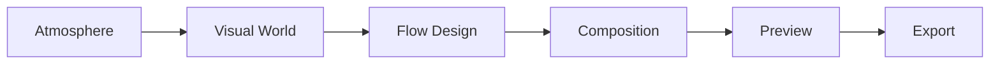
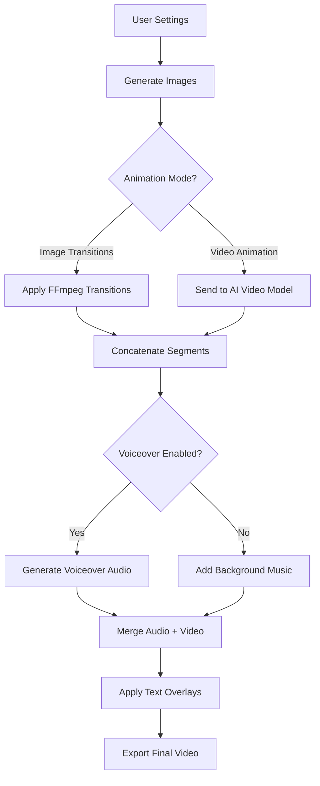
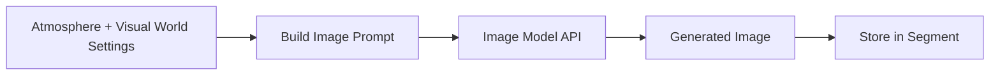
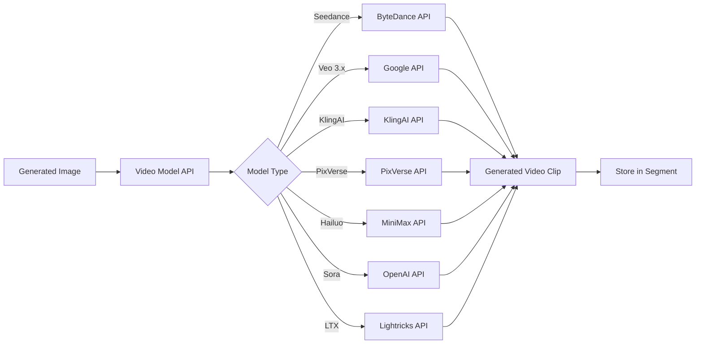
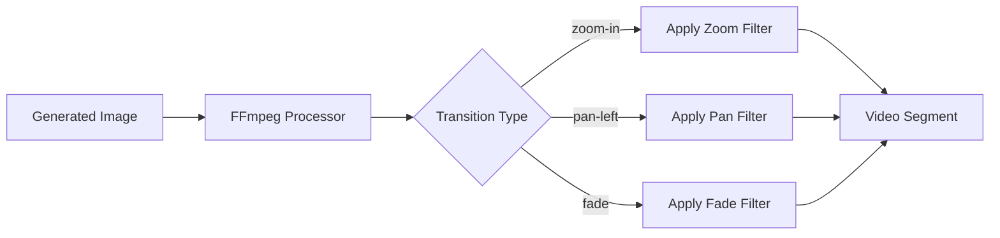

# Ambient Visualizer - Technical Documentation

## Overview

The Ambient Visualizer is a tool for creating long-form, loopable ambient videos for meditation, focus, background ambiance, and relaxation. It generates visually stunning, atmospheric content ranging from 5 minutes to 2 hours.

---

## Table of Contents

1. [Onboarding](#onboarding)
2. [Workflow Steps](#workflow-steps)
3. [Step 1: Atmosphere](#step-1-atmosphere)
4. [Step 2: Visual World](#step-2-visual-world)
5. [Step 3: Flow Design](#step-3-flow-design)
6. [Step 4: Composition](#step-4-composition)
7. [Step 5: Preview](#step-5-preview)
8. [Step 6: Export](#step-6-export)
9. [AI Agent Architecture](#ai-agent-architecture)
10. [Backend Architecture](#backend-architecture)
11. [Data Models](#data-models)

---

## Onboarding

Before entering the main workflow, users go through a quick onboarding process to configure the project's animation approach.

### Onboarding Step 1: Animation Mode Selection

**Purpose**: Choose the fundamental animation technique

**Options**:
1. **Image Transitions**
   - Creates ambient visuals using static images with motion effects (zoom, pan, Ken Burns)
   - Faster generation
   - No additional configuration needed
   - Proceeds directly to Atmosphere (Step 1)

2. **Video Animation**
   - Generates AI-powered animated videos from images
   - Uses advanced video models for natural motion
   - Requires additional configuration (Step 2 of onboarding)

### Onboarding Step 2: Video Generation Mode (Conditional)

**Visibility**: Only shown if "Video Animation" was selected in Step 1

**Purpose**: Choose how to generate animated videos

**Options**:
1. **Image Reference Mode**
   - Generate video from a single reference image
   - AI animates the scene based on motion prompts
   - Simpler workflow

2. **Start/End Frame Mode**
   - Define both starting and ending frames
   - AI creates smooth transitions between states
   - More precise control over animation
   - Enables Continuity Proposal in Flow Design phase

**After onboarding completion, the selected modes are:**
- Locked and displayed as read-only in Atmosphere settings
- Used throughout the workflow to show/hide relevant settings
- Stored as project configuration

### Video Generation Mode Comparison

| Feature | Image-Reference Mode | Start-End Frame Mode |
|---------|---------------------|---------------------|
| **Flow Design** | | |
| Continuity Proposal | Hidden | Available |
| Shot Connection Arrows | Hidden | Visible |
| Lock Button | Hidden | Required before Composition |
| **Composition** | | |
| Frame Tabs | Single image view | "Start" and "End" tabs on all shots |
| Image/Video Tabs | Both tabs (in Video Animation) | Both tabs on all shots |
| Connected Shot Icons | None | Link2 icon between connected shots |
| Drag Reordering | All shots | Blocked for connected shots |
| End Frame Display | N/A | Shows next shot's start (if connected) |
| **Generation** | | |
| Frames per Shot | 1 image | Start + conditional end frame |
| Continuity Groups | N/A | Enforced per locked groups |

---

## Workflow Steps

After completing onboarding, the Ambient Visualizer follows a 6-step workflow:



---

## Step 1: Atmosphere

**Purpose**: Define the emotional foundation and technical settings for the ambient visual.

### Settings Structure

#### 1.1 Image Settings

**Image Model**
- **Type**: Dropdown selection with model details
- **Options**:
  - `nano-banana` - Nano Banana (Google) - Gemini Flash 2.5, Fast & interactive [Default, Fast badge]
    - 10 aspect ratios, 1k resolution, 3K chars max prompt
  - `nano-banana-2-pro` - Nano Banana 2 Pro (Google) - Gemini 3 Pro, Professional-grade, up to 4K [Pro badge]
    - 10 aspect ratios, 1k/2k/4k resolution, 45K chars max prompt
  - `imagen-4.0-preview` - Imagen 4.0 Preview (Google) - Improved textures, lighting, typography
    - 5 aspect ratios, custom resolution, 3K chars max prompt
  - `imagen-4.0-ultra` - Imagen 4.0 Ultra (Google) - Exceptional detail, color accuracy [Ultra badge]
    - 5 aspect ratios, custom resolution, 3K chars max prompt
  - `imagen-4.0-fast` - Imagen 4.0 Fast (Google) - Speed optimized [Fast badge]
    - 5 aspect ratios, custom resolution, 3K chars max prompt, supports negative prompt
  - `seedream-4.0` - Seedream 4.0 (ByteDance) - Ultra-fast 2K/4K with sequential images [Sequential badge]
    - 8 aspect ratios, 1k/2k/4k resolution, 2K chars max prompt
  - `seedream-4.5` - Seedream 4.5 (ByteDance) - Production reliability, sharp 2K/4K [Reliable badge]
    - 8 aspect ratios, 2k/4k resolution, 2K chars max prompt
  - `flux-2-dev` - FLUX.2 [dev] (Black Forest Labs) - Open weights, architectural control [Dev badge]
    - 8 aspect ratios, custom resolution, 10K+ chars max prompt
  - `flux-2-pro` - FLUX.2 [pro] (Black Forest Labs) - Production-ready, robust editing [Pro badge]
    - 7 aspect ratios, custom resolution, 3K chars max prompt
  - `flux-2-flex` - FLUX.2 [flex] (Black Forest Labs) - Best text rendering [Typography badge]
    - 7 aspect ratios, custom resolution, 3K chars max prompt
  - `midjourney-v7` - Midjourney V7 - Cinematic realism, photographic quality [Cinematic badge]
    - 8 aspect ratios, custom resolution, 2K chars max prompt
  - `ideogram-3.0` - Ideogram 3.0 - Sharp text, graphic design specialist [Design badge]
    - 13 aspect ratios, custom resolution, 2K chars max prompt, supports negative prompt
- **Default**: `nano-banana`
- **Backend Field**: `imageModel: string`
- **UI Display**: Shows dynamic capabilities info based on selected model:
  - Number of supported aspect ratios
  - Available resolutions
  - Max prompt length
  - Special features (negative prompt support)

**Image Resolution**
- **Type**: Button selection (dynamic based on model)
- **Options**: Varies by model:
  - Models with specific resolutions: `auto`, `1k`, `2k`, `4k` (available options depend on model)
  - Models with custom resolution: Shows `Auto` only (model handles resolution automatically)
- **Default**: `auto`
- **Backend Field**: `imageResolution: string`
- **Behavior**:
  - `auto` - Let the AI choose optimal resolution based on content
  - `1k` - ~1024px (fastest, suitable for previews)
  - `2k` - ~2048px (balanced quality and speed)
  - `4k` - ~4096px (highest quality, slowest)
- **Model-specific availability**:
  - Nano Banana: 1k only
  - Nano Banana 2 Pro: 1k, 2k, 4k
  - Seedream 4.0: 1k, 2k, 4k
  - Seedream 4.5: 2k, 4k
  - Other models: Custom (auto-optimized)

#### 1.2 Aspect Ratio
- **Type**: Selection (single choice)
- **Options**:
  - `16:9` - YouTube (Horizontal)
  - `9:16` - TikTok, Reels (Vertical)
  - `1:1` - Instagram (Square)
  - `4:5` - Feed Posts (Portrait)
- **Default**: `16:9`
- **Backend Field**: `aspectRatio: string`

#### 1.3 Target Duration
- **Type**: Selection (single choice)
- **Options**:
  - `5min` - 5 minutes
  - `10min` - 10 minutes
  - `30min` - 30 minutes
  - `1hour` - 1 hour
  - `2hours` - 2 hours
- **Default**: `5min`
- **Backend Field**: `duration: string`
- **Backend Processing**: Convert to seconds (e.g., `5min` → `300` seconds)

#### 1.4 Primary Mood
- **Type**: Selection (single choice)
- **Options**:
  - `calm` - Peaceful and serene
  - `mysterious` - Enigmatic and intriguing
  - `energetic` - Dynamic and vibrant
  - `nostalgic` - Wistful and sentimental
  - `cozy` - Warm and comfortable
  - `dark` - Moody and intense
  - `dreamy` - Surreal and floating
  - `ethereal` - Otherworldly and delicate
- **Default**: `calm`
- **Backend Field**: `mood: string`

#### 1.5 Theme / Environment
- **Type**: Selection (single choice)
- **Options**:
  - `nature` - Natural landscapes
  - `urban` - City and architecture
  - `abstract` - Abstract shapes and forms
  - `cosmic` - Space and celestial
  - `interior` - Indoor spaces
  - `fantasy` - Magical and fantastical
- **Default**: `nature`
- **Backend Field**: `theme: string`

#### 1.6 Time Context (Smart Dynamic)
- **Type**: Selection (single choice, theme-dependent)
- **Behavior**: Options change based on selected theme
- **Backend Field**: `timeContext: string`

**Options by Theme**:

| Theme | Label | Options |
|-------|-------|---------|
| `nature`, `urban` | Time of Day | `dawn`, `day`, `sunset`, `night`, `timeless` |
| `cosmic` | Lighting Type | `bright-nebula`, `dark-void`, `star-field`, `eclipse`, `aurora` |
| `abstract` | Energy State | `static`, `flowing`, `pulsing`, `chaotic`, `balanced` |
| `interior` | Lighting Mood | `morning-light`, `afternoon`, `golden-hour`, `evening`, `ambient` |
| `fantasy` | Magical Time | `ethereal-dawn`, `mystical-day`, `enchanted-dusk`, `moonlit-night`, `twilight` |

#### 1.7 Season / Weather (Smart Dynamic)
- **Type**: Selection (single choice, theme-dependent)
- **Behavior**: Options change based on selected theme
- **Backend Field**: `season: string`

**Options by Theme**:

| Theme | Label | Options |
|-------|-------|---------|
| `nature`, `urban` | Season / Weather | `spring`, `summer`, `autumn`, `winter`, `rainy`, `snowy`, `foggy`, `neutral` |
| `cosmic` | Space Density | `sparse`, `moderate`, `dense`, `nebulous`, `energetic`, `calm` |
| `abstract` | Complexity Level | `minimal`, `moderate`, `complex`, `intense`, `layered` |
| `interior` | Ambiance | `warm-cozy`, `cool-fresh`, `natural-light`, `dim-moody`, `bright-airy` |
| `fantasy` | Magical Condition | `magical-bloom`, `mystical-mist`, `enchanted-frost`, `fairy-lights`, `elemental` |

#### 1.8 Animation Mode (Read-Only)
- **Type**: Display only (selected during onboarding)
- **Values**:
  - `image-transitions` - Image Transitions (static images with motion effects)
  - `video-animation` - Video Animation (AI-generated video from images)
- **Backend Field**: `animationMode: 'image-transitions' | 'video-animation'`
- **Note**: This value is set during the onboarding process and cannot be changed in the Atmosphere settings

**Additional Display** (for Video Animation mode):
- **Video Generation Mode**: Shows `image-reference` or `start-end-frame` (also selected during onboarding)

**Purpose**: Displays the animation approach selected during project setup and shows/hides relevant settings accordingly

##### 1.8.1 Image Transitions Settings

**When `animationMode === 'image-transitions'`**:

- **Default Easing Style**
  - **Type**: Selection (single choice)
  - **Options**:
    - `smooth` - Smooth (ease-in-out)
    - `linear` - Linear (constant speed)
    - `ease-in-out` - Ease In-Out
    - `cinematic` - Cinematic
  - **Default**: `smooth`
  - **Backend Field**: `easingStyle: string`
  - **Usage**: Default easing for all image transitions (can be overridden per segment)

##### 1.8.2 Video Animation Settings

**When `animationMode === 'video-animation'`**:

- **Video Model**
  - **Type**: Enhanced dropdown selection with model details
  - **UI Features**:
    - Selected model card showing provider, badge, and capabilities
    - Dropdown with full model details (provider, description, durations, resolutions)
    - Automatic resolution reset when model changes
  - **Options** (imported from `@/constants/video-models`):
    - `seedance-1.0-pro` - Seedance 1.0 Pro (ByteDance) - 2-12s, 480p-1080p [Default]
    - `veo-3.0` - Google Veo 3.0 (Google) - 4-8s, 720p-1080p
    - `veo-3.1` - Google Veo 3.1 (Google) - 4-8s, 720p-1080p [Cinematic]
    - `klingai-2.5-turbo-pro` - KlingAI 2.5 Turbo Pro (KlingAI) - 5-10s, 720p [Turbo]
    - `pixverse-v5.5` - PixVerse v5.5 (PixVerse) - 5-8s, 360p-1080p
    - `hailuo-2.3` - MiniMax Hailuo 2.3 (MiniMax) - 6-10s, 768p-1080p
    - `sora-2-pro` - Sora 2 Pro (OpenAI) - 4-12s, 720p [Pro]
    - `ltx-2-pro` - LTX-2 Pro (Lightricks) - 6-10s, 1080p-4K [4K]
  - **Default**: `seedance-1.0-pro` (from `getDefaultVideoModel()`)
  - **Backend Field**: `videoModel: string`
  - **Backend Integration**: Different API endpoints per model

- **Video Resolution** (Dynamic)
  - **Type**: Button selection
  - **Options**: Dynamic based on selected model's supported resolutions
  - **Display Labels**: Uses `VIDEO_RESOLUTION_LABELS` for user-friendly display
    - `360p`, `480p`, `540p`, `720p (HD)`, `768p`, `1080p (Full HD)`, `1440p (2K)`, `2160p (4K)`
  - **Default**: First resolution from selected model
  - **Backend Field**: `videoResolution: string`
  - **Behavior**: Automatically resets to model's first supported resolution when model changes

- **Motion Prompt**
  - **Type**: Textarea (multiline text)
  - **Placeholder**: "e.g., Gentle floating particles, subtle light rays moving slowly, soft camera drift..."
  - **Default**: Empty string
  - **Backend Field**: `motionPrompt: string`
  - **Usage**: Custom instructions for AI video generation, applied globally to all video segments

#### 1.9 Transition Style / Camera Motion (Conditional)

**This setting is conditional based on Animation Mode selected during onboarding.**

##### 1.9.1 When `animationMode === 'image-transitions'`

**Transition Style**
- **Type**: Button grid selection (2 columns)
- **Options**:
  - `auto` - Auto (AI selects best transition per scene)
  - `crossfade` - Smooth Crossfade (Gentle blend between scenes)
  - `dissolve` - Slow Dissolve (Gradual fade transition)
  - `drift` - Drift (Floating motion blend)
  - `match-cut` - Match Cut (Seamless visual continuity)
  - `morph` - Morph (Shape transformation)
  - `wipe` - Soft Wipe (Directional reveal)
- **Default**: `auto`
- **Backend Field**: `transitionStyle: string`
- **Usage**: How images transition between each other

##### 1.9.2 When `animationMode === 'video-animation'`

**Camera Motion**
- **Type**: Button selection (flex wrap)
- **Options**:
  - `auto` - Auto (AI selects best camera motion per scene)
  - `static` - Static
  - `slow-pan` - Slow Pan
  - `gentle-drift` - Gentle Drift
  - `orbit` - Orbit
  - `push-in` - Push In
  - `pull-out` - Pull Out
  - `float` - Floating
- **Default**: `auto`
- **Backend Field**: `cameraMotion: string`
- **Usage**: Default camera movement for AI-generated video clips

**Note**: These settings occupy the same UI space and swap based on the selected Animation Mode.

#### 1.10 Pacing & Flow Settings

**Note**: Moved from Flow Design (Step 3) to Atmosphere for better workflow organization.

##### 1.10.1 Pacing
- **Type**: Slider (0-100)
- **Default**: `30`
- **Backend Field**: `pacing: number`
- **Usage**: How quickly visual changes occur (0 = very slow, 100 = fast-paced).

##### 1.10.2 Segment Settings
- **Type**: Toggle (On/Off)
- **Default**: `true` (On)
- **Backend Field**: `segmentEnabled: boolean`
- **Usage**: When enabled, allows custom configuration of segments and shots.

###### 1.10.2.1 Conditional Segment Settings (When Segment Settings is ON)

**Number of Segments**
- **Type**: Auto button / Number input (1-20)
- **Default**: `auto`
- **Backend Field**: `segmentCount: 'auto' | number`
- **Usage**: Defines the number of distinct visual segments in the video.

**Shots per Segment**
- **Type**: Auto button / Number input (1-10)
- **Default**: `auto`
- **Backend Field**: `shotsPerSegment: 'auto' | number`
- **Usage**: Defines the number of individual shots within each segment.

##### 1.10.3 Loop Mode
- **Type**: Toggle (On/Off)
- **Default**: `true` (On)
- **Backend Field**: `loopMode: boolean`
- **Usage**: When enabled, the video will loop back to the beginning seamlessly.

###### 1.10.3.1 Loop Settings (Conditional - When Loop is ON)

**Loop Type**
- **Type**: Button selection (single choice)
- **Options**:
  - `seamless` - Seamless (perfect continuous loop)
  - `fade` - Fade (fade out then fade in)
  - `hard-cut` - Hard Cut (direct cut to beginning)
- **Default**: `seamless`
- **Backend Field**: `loopType: 'seamless' | 'fade' | 'hard-cut'`

**Segment Loop**
- **Type**: Toggle (On/Off)
- **Default**: `false` (Off)
- **Backend Field**: `segmentLoopEnabled: boolean`
- **Usage**: When enabled, individual segments will loop a specified number of times.

**Segment Loop Count** (Conditional - When Segment Loop is ON)
- **Type**: Auto button / Number input (1-10)
- **Default**: `auto`
- **Backend Field**: `segmentLoopCount: 'auto' | number`

**Shot Loop**
- **Type**: Toggle (On/Off)
- **Default**: `false` (Off)
- **Backend Field**: `shotLoopEnabled: boolean`
- **Usage**: When enabled, individual shots within segments will loop a specified number of times.

**Shot Loop Count** (Conditional - When Shot Loop is ON)
- **Type**: Auto button / Number input (1-10)
- **Default**: `auto`
- **Backend Field**: `shotLoopCount: 'auto' | number`

#### 1.11 Voiceover

**Note**: Voiceover is always the last setting in the Atmosphere tab.

##### 1.11.1 Enable Voiceover
- **Type**: Toggle (On/Off)
- **Default**: `false` (Off)
- **Backend Field**: `voiceoverEnabled: boolean`

##### 1.11.2 Voiceover Settings (Conditional)

**When `voiceoverEnabled === true`**:

- **Language**
  - **Type**: Dropdown selection
  - **Options**:
    - `en` - English (US)
    - `ar` - Arabic (العربية)
  - **Default**: `en`
  - **Backend Field**: `language: 'ar' | 'en'`

- **Text Overlay**
  - **Type**: Toggle (On/Off)
  - **Default**: `false` (Off)
  - **Backend Field**: `textOverlayEnabled: boolean`

- **Text Overlay Style** (when Text Overlay is On)
  - **Type**: Button selection
  - **Options**:
    - `modern` - Modern
    - `cinematic` - Cinematic
    - `bold` - Bold
  - **Default**: `modern`
  - **Backend Field**: `textOverlayStyle: 'modern' | 'cinematic' | 'bold'`

#### 1.12 AI Idea Generator

- **AI Prompt Input**
  - **Type**: Text input
  - **Placeholder**: "Ask AI to write an ambient visual about..."
  - **Backend Field**: `aiPrompt: string`

- **Your Idea (Mood Description)**
  - **Type**: Textarea (multiline)
  - **Placeholder**: "Write your ambient visual idea here, or use the AI generator above to create one..."
  - **Backend Field**: `moodDescription: string`
  - **Usage**: Detailed description that guides all generation (images, video, audio)

---

## Step 2: Visual World

**Purpose**: Define the artistic style and visual characteristics.

### Settings Structure

#### 2.1 Art Style & Reference Images (Combined Card)

This combined card allows users to either select a preset art style OR upload reference images for custom styling.

**Art Style Selection**:
- **Type**: Selection (button grid, 2 columns)
- **Options**:
  - `cinematic` - Cinematic (Film-quality realism)
  - `anime` - Anime (Japanese animation style)
  - `illustrated` - Illustrated (Digital art look)
  - `realistic` - Realistic (Photo-realistic)
  - `abstract` - Abstract (Non-representational)
  - `painterly` - Painterly (Oil painting texture)
  - `watercolor` - Watercolor (Soft, flowing edges)
  - `minimalist` - Minimalist (Clean and simple)
- **Default**: `cinematic`
- **Backend Field**: `artStyle: string`
- **Usage**: Determines the visual rendering style for image generation

**Style Reference Images**:
- **Type**: Image upload (multiple, max 4)
- **Backend Field**: `referenceImages: string[]` (URLs or file paths)
- **Usage**: Upload images to guide the visual style (AI will match the aesthetic)
- **Note**: Reference images can be used alongside or instead of preset art styles

#### 2.2 Key Visual Elements
- **Type**: Multi-select badges (max 5)
- **Options**: Mountains, Ocean, Forest, City Lights, Stars, Rain, Fireplace, Clouds, Waves, Snow, Aurora, Fog, Flowers, Desert, Lake, Waterfall, Sunset Sky, Neon Signs
- **Backend Field**: `visualElements: string[]`
- **Usage**: Specific elements to feature in scenes

#### 2.3 Visual Rhythm
- **Type**: Button grid selection (2 columns)
- **Options**:
  - `constant` - Constant Calm (Steady, unchanging pace)
  - `breathing` - Breathing (Subtle rhythmic pulse)
  - `building` - Building (Gradually intensifying)
  - `wave` - Wave (Rising and falling)
- **Default**: `breathing`
- **Backend Field**: `visualRhythm: string`
- **Usage**: How the experience unfolds over time
- **Note**: Moved from Flow Design (Step 3) to Visual World for better workflow organization

#### 2.4 Custom Image Instructions
- **Type**: Textarea (multiline text)
- **Placeholder**: "e.g., Use soft focus on backgrounds, include lens flares, maintain consistent color grading across all shots, avoid harsh shadows..."
- **Default**: Empty string
- **Backend Field**: `imageCustomInstructions: string`
- **Usage**: Custom instructions to guide AI image generation, applied globally to all generated images
- **Examples**:
  - "Maintain warm color temperature throughout"
  - "Use shallow depth of field with bokeh effects"
  - "Add subtle film grain for vintage look"
  - "Keep lighting dramatic with strong shadows"

---

## Step 3: Flow Design (Scene Breakdown)

**Purpose**: Create and manage the visual segments (scenes and shots) that make up the ambient experience.

**Note**: This step uses the SceneBreakdown component which allows AI-powered generation or manual creation of scenes.

### Overview

The Flow Design phase leverages the atmosphere description and visual world settings to break down the ambient visual into structured scenes and shots. This step:
- Uses the mood description as the "script" input
- Generates scenes based on the configured atmosphere
- Allows manual scene creation and editing
- Supports continuity management across scenes
- Provides shot-level control within scenes

### Key Features

#### 3.1 AI Scene Generation

**Trigger**: "Generate Flow Design" button

**Process**:
1. Takes the mood description from Step 1 (Atmosphere)
2. Uses the selected image model and theme settings
3. Generates a sequence of scenes with:
   - Scene descriptions
   - Shot breakdowns within each scene
   - Duration estimates
   - Visual prompts

**Backend Integration**:
- **Endpoint**: `/api/videos/:videoId/scene-breakdown`
- **Input**: Mood description (as script), atmosphere settings
- **Output**: Array of `Scene` objects with nested `Shot` arrays

#### 3.2 Manual Scene Management

**Actions**:
- **Add Scene Manually**: Create custom scenes with specific descriptions
- **Edit Scene**: Modify scene descriptions and settings
- **Delete Scene**: Remove unwanted scenes
- **Reorder Scenes**: Drag-and-drop or move up/down buttons

#### 3.3 Shot Management

Within each scene:
- **Generate Shots**: AI creates shot variations
- **Edit Shots**: Modify prompts, duration, or settings
- **Add Shots**: Manually create additional shots
- **Delete Shots**: Remove specific shots
- **Upload References**: Add reference images for shots

#### 3.4 Continuity Management (Start-End Frame Mode Only)

**Note**: Continuity management is only available when Video Animation mode with Start-End Frame generation is selected during onboarding. In Image-Reference mode, this section is hidden.

**Continuity Proposal System**:
- **Generate Proposal**: AI analyzes all shots across scenes and proposes shot connections
- **Review Arrows**: Visual arrows in the shot list show proposed connections
- **Approve/Decline**: Accept or reject individual connections per scene
- **Lock Continuity**: Once approved, lock the continuity to proceed to Composition

**Visual Indicators**:
- **Blue arrows**: Proposed connections pending review
- **Green indicators**: Approved connections
- **Status bar**: Shows count of approved vs. pending connections

**How It Works**:
1. Click "Analyze All Shots for Continuity" button
2. AI proposes groups of shots that should connect seamlessly
3. Review each proposed connection (shown as arrows between shots)
4. Approve or decline connections using the buttons
5. When at least one group is approved, click "Lock & Continue"
6. Once locked, continuity cannot be changed

**Connection Types**:
- `flow`: Smooth camera movement between shots
- `pan`: Continuous pan across scene elements
- `character-movement`: Following subject from one position to another

**Backend Fields**: 
- `continuityLocked: boolean` - Whether continuity is finalized
- `continuityGroups: { [sceneId: string]: ContinuityGroup[] }` - Approved connections by scene

### Data Structure

#### Scene Object
```typescript
interface Scene {
  id: string;
  sceneNumber: number;
  description: string;
  setting: string;
  duration: number;
  order: number;
}
```

#### Shot Object
```typescript
interface Shot {
  id: string;
  sceneId: string;
  shotNumber: number;
  description: string;
  visualPrompt: string;
  duration: number;
  shotType: string;
  cameraAngle: string;
  order: number;
}
```

#### Shot Version Object
```typescript
interface ShotVersion {
  id: string;
  shotId: string;
  versionNumber: number;
  visualPrompt: string;
  imageUrl?: string;
  selected: boolean;
}
```

### Navigation

After completing scene/shot setup, clicking "Continue" proceeds to Step 4 (Composition) where individual segments are configured with motion and effects.

---

## Step 4: Composition (Storyboard Editor)

**Purpose**: Generate images/videos for each shot, manage versions, and refine the visual composition.

**Note**: This step uses the StoryboardEditor component which works with scenes and shots created in the Flow Design phase.

### Overview

The Composition phase takes the scenes and shots from Flow Design and allows:
- Image/video generation for each shot
- Per-scene model selection (image model, video model)
- Animation mode configuration per scene
- Shot prompt editing and refinement
- Version management with comparison
- Drag-and-drop shot reordering

### View Modes

#### 4.1 Cards View (Default)
- Grid layout of shot cards organized by scene
- Each card shows:
  - Shot thumbnail (generated image or placeholder)
  - Shot number and description
  - Duration
  - Generate/Regenerate button
  - Edit prompt controls

#### 4.2 Timeline View
- Horizontal timeline representation
- Visual duration bars for each shot
- Playhead for navigation
- Quick overview of total video length

### Per-Scene Settings

Each scene can have its own settings:

#### 4.3 Image Model Selection
- **Type**: Dropdown
- **Options**: Flux, Midjourney, Nano Banana, GPT Image
- **Default**: Inherits from Atmosphere settings
- **Backend Field**: `sceneImageModel: string`

#### 4.4 Video Model Selection (Video Animation Mode)
- **Type**: Dropdown
- **Options**: (Inherited from `@/constants/video-models`)
  - Seedance 1.0 Pro (ByteDance) [Default]
  - Google Veo 3.0, Veo 3.1 (Google)
  - KlingAI 2.5 Turbo Pro (KlingAI)
  - PixVerse v5.5 (PixVerse)
  - MiniMax Hailuo 2.3 (MiniMax)
  - Sora 2 Pro (OpenAI)
  - LTX-2 Pro (Lightricks)
- **Default**: Inherits from Atmosphere settings
- **Backend Field**: `sceneVideoModel: string`

#### 4.5 Animation Mode (Per-Scene Override)
- **Options**:
  - `smooth-image` - Smooth Image (Ken Burns effect)
  - `animate` - Full Animation (AI Video generation)
- **Backend Field**: `sceneAnimationMode: string`

### Shot Card Features

#### 4.6 Frame Display (Mode-Dependent)

**Image-Reference Mode**:
- Single image view per shot
- Both Image and Video tabs available (in Video Animation mode)
- Full drag-and-drop reordering capability

**Start-End Frame Mode** (requires locked continuity from Flow Design):
- **Start/End Tab Selector**: All shots show Start and End tabs (matching Narrative mode behavior)
- **Image/Video Tabs**: All shots show both Image and Video tabs (in Video Animation mode)
- **Start Frame**: Beginning state of the shot (always generated)
- **End Frame**: 
  - For connected shots: Shows the next shot's start frame (synced automatically)
  - For standalone/last shots: Shows the shot's own end frame
- **Connection Indicators**: Link2 icon (cyan/teal) between connected shots
- **Drag Restrictions**: Connected shots cannot be reordered to maintain continuity
- **UI Styling**: Consistent cyan/teal color theme (buttons use `variant="ghost"` with gradient, badges use `variant="outline"`)

#### 4.7 Shot Generation
- **Generate**: Creates initial image for the shot using visual prompt
- **Regenerate**: Creates a new version while keeping existing versions
- **Upload Reference**: Add reference image to guide generation

#### 4.8 Prompt Editing
- Edit the visual prompt for the shot
- Apply quick edit categories:
  - Prompt refinement
  - Clothing changes
  - Element removal
  - Expression changes
  - Figure adjustments
  - Camera angle
  - Effects
  - Variations

#### 4.9 Version Management
- Multiple versions per shot
- Compare mode for side-by-side comparison
- Select active version
- Delete unwanted versions

#### 4.10 Shot Duration
- Adjustable duration per shot (3-10 seconds typical)
- Visual duration indicators
- Affects final video length

### Shot Types
- Extreme Close-up
- Close-up
- Medium Close-up
- Medium Shot
- Medium Wide Shot
- Wide Shot
- Extreme Wide Shot
- Over-the-Shoulder
- Point of View
- Establishing Shot

### Camera Movements
- Static
- Pan Left / Right
- Tilt Up / Down
- Zoom In / Out
- Dolly In / Out
- Tracking Shot
- Crane Up / Down
- Handheld
- Steadicam

### Transition Types
- Cut (instant)
- Fade (to/from black)
- Dissolve (cross-dissolve)
- Wipe
- Slide

### Actions Available

| Action | Description |
|--------|-------------|
| Add Scene | Insert new scene after current |
| Delete Scene | Remove scene and all its shots |
| Add Shot | Insert new shot in current scene |
| Delete Shot | Remove shot from scene |
| Reorder Shots | Drag-and-drop within scene |
| Generate All | Generate images for all shots |

### Backend Integration

**Endpoints**:
- `POST /api/shots/:shotId/generate` - Generate image for shot
- `POST /api/shots/:shotId/regenerate` - Create new version
- `PUT /api/shots/:shotId` - Update shot details
- `POST /api/shots/:shotId/reference` - Upload reference image
- `DELETE /api/shots/:shotId/reference` - Remove reference image

### Navigation

After completing shot generation and refinement, clicking "Continue to Animatic" proceeds to Step 5 (Preview) where the full ambient video is assembled and previewed.

---

## Step 5: Preview

**Purpose**: Preview the assembled ambient visual before export.

### Features
- Play/pause controls
- Seek timeline
- Quality preview (lower resolution for fast loading)
- Loop preview to test seamlessness

---

## Step 6: Export

**Purpose**: Generate final video and prepare for distribution.

### Export Options

#### 6.1 Video Quality
- **Options**: Draft, Standard, High Quality, Ultra HD
- **Backend Field**: `exportQuality: string`

#### 6.2 File Format
- **Options**: MP4, WebM, MOV
- **Backend Field**: `fileFormat: string`

#### 6.3 Audio Options
- **Voiceover**: Include generated voiceover (if enabled)
- **Background Music**: Optional ambient music track
- **Audio Mixing**: Volume levels for voiceover and music

---

## AI Agent Architecture

The Ambient Visualizer uses **12 specialized agents** (7 AI-powered, 5 non-AI) to automate the video creation pipeline.

### Agent Overview

| Step | Agent | Role | AI Model Type |
|------|-------|------|---------------|
| **1. Atmosphere** | Mood Description Generator | Generate atmospheric description from user settings | Text Generation |
| **2. Visual World** | *(None)* | User uploads reference images manually | N/A |
| **3. Flow Design** | Scene Generator | Generate scenes based on mood/theme | Text Generation |
| | Shot Composer | Break scenes into individual shots | Text Generation |
| | Continuity Producer | Propose shot connections (Start-End mode only) | Text Generation |
| **4. Composition** | Image/Video Prompt Engineer | Build optimized prompts for image and video generation | Text Generation |
| | Keyframe Image Generator | Generate keyframe images from prompts | Text-to-Image |
| | Video Generator | Animate images into video clips | Image-to-Video |
| | Image Transition Processor | Apply FFmpeg transitions (Image Transitions mode) | Non-AI |
| **5. Preview** | Voiceover Synthesizer | Generate voiceover from script | Text-to-Speech |
| | Video Compositor | Concatenate segments into full video | Non-AI |
| | Audio Mixer | Merge audio and video tracks | Non-AI |
| **6. Export** | Final Video Renderer | Export with quality settings | Non-AI |

### Agent Statistics

| Category | Count |
|----------|-------|
| **Total Agents** | 12 |
| **AI Agents** | 7 |
| **Non-AI Agents** | 5 |
| **Start-End Mode Only** | 1 (Continuity Producer) |

### AI Model Requirements

| Model Type | Use Cases | Suggested Providers |
|------------|-----------|---------------------|
| Text Generation | Mood description, scene analysis, prompt engineering | GPT-4, Claude, Gemini |
| Text-to-Image | Keyframe generation | Imagen 4, FLUX, Midjourney, Ideogram, Seedream |
| Image-to-Video | Video animation | Veo, Kling, Seedance, PixVerse, Hailuo, Sora, LTX |
| Text-to-Speech | Voiceover synthesis | Eleven Labs, Google TTS |

### Agent Details

#### Agent 1.1: Mood Description Generator

**Step**: Atmosphere  
**Type**: AI (Text Generation)  
**Role**: Analyze user's atmosphere settings and generate a rich, descriptive mood paragraph

**Inputs**:
- Mood selection (calm, dreamy, mysterious, etc.)
- Theme selection (nature, urban, abstract, etc.)
- Time context (dawn, day, dusk, night)
- Season/weather settings

**Outputs**:
- `moodDescription`: Rich text paragraph describing the overall atmosphere

---

#### Agent 3.1: Scene Generator

**Step**: Flow Design  
**Type**: AI (Text Generation)  
**Role**: Generate scene structure based on mood description and duration

**Inputs**:
- Mood description (from Agent 1.1)
- Target duration
- Visual world settings

**Outputs**:
- Array of scene objects with titles and descriptions

---

#### Agent 3.2: Shot Composer

**Step**: Flow Design  
**Type**: AI (Text Generation)  
**Role**: Break each scene into individual shots with timing

**Inputs**:
- Scene data (from Agent 3.1)
- Pacing settings
- Shots per segment preference

**Outputs**:
- Array of shot objects per scene with descriptions and durations

---

#### Agent 3.3: Continuity Producer

**Step**: Flow Design  
**Type**: AI (Text Generation)  
**Visibility**: Start-End Frame Mode only  
**Role**: Propose shot connections for smooth visual transitions

**Inputs**:
- All shots across scenes
- Visual coherence requirements

**Outputs**:
- Proposed continuity groups (connected shot sequences)
- Connection rationale

---

#### Agent 4.1: Image/Video Prompt Engineer

**Step**: Composition  
**Type**: AI (Text Generation)  
**Role**: Build optimized prompts for both image and video generation

**Inputs**:
- Shot description
- Art style settings
- Visual elements
- Reference images (if uploaded)
- Custom image instructions

**Outputs**:
- `imagePrompt`: Optimized prompt for image generation
- `videoPrompt`: Motion prompt for video generation
- `negativePrompt`: Elements to avoid (if model supports)

---

#### Agent 4.2: Keyframe Image Generator

**Step**: Composition  
**Type**: AI (Text-to-Image)  
**Role**: Generate keyframe images for each shot

**Inputs**:
- Image prompt (from Agent 4.1)
- Negative prompt (optional)
- Reference images (optional)
- Aspect ratio
- Resolution settings
- Selected image model

**Outputs**:
- `imageUrl`: Generated keyframe image URL
- `imageVersion`: Version tracking for regeneration

**Supported Models**: Imagen 4, FLUX, Midjourney, Ideogram, Seedream, Nano Banana

---

#### Agent 4.3: Video Generator

**Step**: Composition  
**Type**: AI (Image-to-Video)  
**Visibility**: Video Animation mode only  
**Role**: Animate keyframe images into video clips

**Inputs**:
- Keyframe image URL (from Agent 4.2)
- Video prompt (from Agent 4.1)
- Camera motion settings
- Duration
- Selected video model
- End frame image (Start-End Frame mode only)

**Outputs**:
- `videoUrl`: Generated video clip URL
- `duration`: Actual video duration

**Supported Models**: Veo 3.x, Kling AI, Seedance, PixVerse, Hailuo, Sora, LTX

---

#### Agent 4.4: Image Transition Processor

**Step**: Composition  
**Type**: Non-AI (FFmpeg)  
**Visibility**: Image Transitions mode only  
**Role**: Apply motion effects to static images

**Inputs**:
- Keyframe image URL
- Transition type (zoom-in, zoom-out, pan-left, pan-right, etc.)
- Easing style
- Duration

**Outputs**:
- `videoUrl`: Video segment with applied transition

---

#### Agent 5.1: Voiceover Synthesizer

**Step**: Preview  
**Type**: AI (Text-to-Speech)  
**Visibility**: When voiceover is enabled  
**Role**: Generate voiceover audio from script

**Inputs**:
- Voiceover script
- Language selection
- Voice actor ID
- Target duration

**Outputs**:
- `audioUrl`: Generated voiceover audio URL

**Supported Providers**: Eleven Labs, Google TTS

---

#### Agent 5.2: Video Compositor

**Step**: Preview  
**Type**: Non-AI (FFmpeg)  
**Role**: Concatenate all video segments into final video

**Inputs**:
- Array of video segment URLs
- Transition style between segments
- Loop mode settings

**Outputs**:
- `compositeVideoUrl`: Full concatenated video

---

#### Agent 5.3: Audio Mixer

**Step**: Preview  
**Type**: Non-AI (FFmpeg)  
**Role**: Merge audio tracks with video

**Inputs**:
- Composite video URL (from Agent 5.2)
- Voiceover audio URL (optional)
- Background music selection
- Volume levels

**Outputs**:
- `finalVideoUrl`: Video with mixed audio

---

#### Agent 6.1: Final Video Renderer

**Step**: Export  
**Type**: Non-AI (FFmpeg)  
**Role**: Export final video with specified quality settings

**Inputs**:
- Final video URL (from Agent 5.3)
- Export quality (Draft, Standard, High Quality, Ultra HD)
- File format (MP4, WebM, MOV)

**Outputs**:
- `downloadUrl`: Exportable video file
- `fileSize`: File size in bytes
- `duration`: Final duration

---

## Backend Architecture

### Video Generation Pipeline



### Image Generation Flow



**Prompt Construction**:
```
[mood] [theme] scene with [time context], [season/weather] atmosphere. 
[Art style], [color palette] colors, [lighting mood] lighting, [texture] texture.
Including [visual elements]. [Atmospheric layers] effects.
[Mood description]
```

### Video Generation Flow (Video Animation Mode)



**Video Generation Parameters**:
- Input: Keyframe image
- Camera motion: From segment settings
- Motion prompt: Global from Atmosphere step
- Resolution: Dynamic based on selected model's supported resolutions
- Duration: Model-specific durations (e.g., 2-12s for Seedance, 4-8s for Veo)

### Image Transitions Flow (Image Transitions Mode)



**FFmpeg Commands**:

**Zoom In**:
```bash
ffmpeg -loop 1 -i image.png -t {duration} \
  -vf "zoompan=z='min(zoom+0.0015,1.5)':d={frames}:x='iw/2-(iw/zoom/2)':y='ih/2-(ih/zoom/2)':s={resolution}" \
  -c:v libx264 output.mp4
```

**Pan Left**:
```bash
ffmpeg -loop 1 -i image.png -t {duration} \
  -vf "scale=2*iw:-1,crop=iw/2:ih:x='if(gte(t,{duration}),iw/2,t*iw/{duration}/2)':y=0" \
  -c:v libx264 output.mp4
```

**Easing Curves** (via expression):
- `smooth`: `easeInOutCubic = t*t*(3-2*t)`
- `linear`: `t`
- `ease-in-out`: `t<0.5 ? 2*t*t : -1+(4-2*t)*t`
- `cinematic`: Custom Bezier curve

---

## Data Models

### Project Data Structure

```typescript
interface AmbientVisualProject {
  id: string;
  name: string;
  createdAt: Date;
  updatedAt: Date;
  
  // Step 1: Atmosphere
  atmosphere: {
    imageModel: string; // Image model selection
    imageResolution: string; // NEW: Image resolution (auto, 1k, 2k, 4k)
    aspectRatio: string;
    duration: string;
    mood: string;
    theme: string;
    timeContext: string;
    season: string;
    animationMode: 'image-transitions' | 'video-animation';
    videoGenerationMode?: 'image-reference' | 'start-end-frame'; // Only for video-animation
    
    // Animation Mode Settings
    easingStyle?: string; // for image-transitions
    videoModel?: string; // for video-animation
    videoResolution?: string; // for video-animation
    motionPrompt?: string; // for video-animation
    
    // Transition/Camera (moved from Flow Design)
    transitionStyle: string; // for image-transitions
    cameraMotion: string; // for video-animation
    
    // Pacing & Flow (moved from Flow Design)
    pacing: number;
    segmentEnabled: boolean;
    segmentCount: 'auto' | number;
    shotsPerSegment: 'auto' | number;
    loopMode: boolean;
    loopType: 'seamless' | 'fade' | 'hard-cut';
    segmentLoopEnabled: boolean;
    segmentLoopCount: 'auto' | number;
    shotLoopEnabled: boolean;
    shotLoopCount: 'auto' | number;
    
    // Voiceover
    voiceoverEnabled: boolean;
    language?: 'ar' | 'en';
    textOverlayEnabled?: boolean;
    textOverlayStyle?: 'modern' | 'cinematic' | 'bold';
    
    // AI Generated
    moodDescription: string;
  };
  
  // Step 2: Visual World
  visualWorld: {
    artStyle: string;
    visualElements: string[];
    visualRhythm: string; // MOVED from Flow Design
    referenceImages: string[];
    // REMOVED: colorPalette, lightingMood, texture, atmosphericLayers
  };
  
  // Step 3: Flow Design (Scene Breakdown)
  flowDesign: {
    scenes: Scene[];
    shots: { [sceneId: string]: Shot[] };
    shotVersions?: { [shotId: string]: ShotVersion[] };
    continuityLocked: boolean;
    continuityGroups: { [sceneId: string]: ContinuityGroup[] };
  };
  
  // Step 4: Composition (uses scenes/shots from Flow Design)
  // StoryboardEditor works with flowDesign.scenes and flowDesign.shots
  // Additional composition state:
  composition: {
    shotReferenceImages: ReferenceImage[];
    characters: Character[];
    voiceActorId: string | null;
    sceneSettings: {
      [sceneId: string]: {
        imageModel?: string;
        videoModel?: string;
        animationMode?: 'smooth-image' | 'animate';
      };
    };
  };
  
  // Export
  exportSettings?: {
    quality: string;
    format: string;
    includeVoiceover: boolean;
    backgroundMusic: boolean;
  };
  
  // Generated Assets
  assets: {
    images: string[]; // URLs to generated images
    videos: string[]; // URLs to generated video clips (if video animation)
    audio?: string; // URL to generated voiceover
    finalVideo?: string; // URL to exported final video
  };
}
```

---

## API Endpoints

### Image Generation
```
POST /api/ambient/generate-image
Body: {
  prompt: string,
  style: string,
  resolution: string,
  aspectRatio: string
}
Response: {
  imageUrl: string
}
```

### Video Generation (Video Animation Mode)
```
POST /api/ambient/generate-video
Body: {
  imageUrl: string,
  videoModel: string,
  resolution: string,
  duration: number,
  cameraMotion: string,
  motionPrompt: string
}
Response: {
  videoUrl: string,
  duration: number
}
```

### Image Transition Processing (Image Transitions Mode)
```
POST /api/ambient/apply-transition
Body: {
  imageUrl: string,
  transitionType: string,
  easingStyle: string,
  duration: number,
  resolution: string
}
Response: {
  videoUrl: string
}
```

### Concatenate Segments
```
POST /api/ambient/concatenate
Body: {
  segmentUrls: string[],
  transitionStyle: string,
  loopMode: string
}
Response: {
  videoUrl: string,
  duration: number
}
```

### Generate Voiceover
```
POST /api/ambient/generate-voiceover
Body: {
  script: string,
  language: string,
  duration: number
}
Response: {
  audioUrl: string
}
```

### Merge Audio + Video
```
POST /api/ambient/merge-audio-video
Body: {
  videoUrl: string,
  audioUrl: string,
  videoVolume: number,
  audioVolume: number
}
Response: {
  finalVideoUrl: string
}
```

### Export Final Video
```
POST /api/ambient/export
Body: {
  projectId: string,
  quality: string,
  format: string
}
Response: {
  downloadUrl: string,
  fileSize: number,
  duration: number
}
```

---

## Technical Considerations

### State Management & UI Architecture

1. **Component State Persistence**:
   - The `AmbientVisualWorkflow` component maintains all state (atmosphere, visual world, flow design, composition settings) across step navigation
   - **Critical Implementation**: The workflow component must NOT be unmounted/remounted when navigating between steps
   - **Solution**: Removed `AnimatePresence` wrapper with `key={currentStep}` from layout to prevent remounting
   - **Result**: All user selections (animationMode, aspectRatio, mood, etc.) persist across navigation

2. **Conditional Rendering**:
   - Flow Design (Step 3) dynamically renders either "Transition Style" or "Camera Motion" based on `animationMode`
   - Voiceover sub-settings expand/collapse with animation using Framer Motion
   - Loop sub-settings (Loop Type, Segment Loop, Shot Loop) show when Loop Mode is enabled

3. **Smart Dynamic Options**:
   - Time Context and Season/Weather options change based on selected Theme
   - Backend should validate that selected values are contextually valid for the theme

### Performance Optimization

1. **Image Generation**:
   - Batch generate all images upfront in Composition step
   - Cache generated images to avoid regeneration
   - Use lower resolution for preview, full resolution for export

2. **Video Processing**:
   - Process segments in parallel when possible
   - Use hardware acceleration (GPU) for FFmpeg operations
   - Progressive encoding for streaming preview

3. **Storage**:
   - Store assets in CDN (S3, Cloudflare R2)
   - Clean up temporary files after export
   - Implement asset lifecycle management

### Error Handling

1. **Image Generation Failures**:
   - Retry with adjusted prompts
   - Fallback to similar cached images
   - Allow manual image upload

2. **Video Generation Timeouts**:
   - Implement queue system for long-running jobs
   - Provide progress updates via WebSocket
   - Allow resume on failure

3. **FFmpeg Errors**:
   - Validate input formats
   - Handle codec incompatibilities
   - Provide detailed error messages

---

## Future Enhancements

1. **Real-time Preview**: Stream segments as they're generated
2. **AI Voice Cloning**: Custom narrator voices
3. **Music Generation**: AI-generated ambient soundtracks
4. **Interactive Elements**: User-triggered visual changes
5. **3D Environments**: WebGL-based real-time rendering
6. **Export to Social**: Direct publishing to YouTube, TikTok, etc.

---

## Glossary

- **Ambient Visual**: Long-form, loopable video content designed for background viewing
- **Segment**: Individual visual section with its own duration and settings
- **Keyframe**: The base image for a segment
- **Easing**: Animation timing function that controls acceleration/deceleration
- **Transition**: Visual effect applied between segments or within a segment
- **Motion Prompt**: Text instructions for AI video generation
- **Loop Mode**: How the video connects end-to-start for seamless looping

---

**Document Version**: 1.1  
**Last Updated**: December 16, 2024  
**Authors**: Storia Development Team

